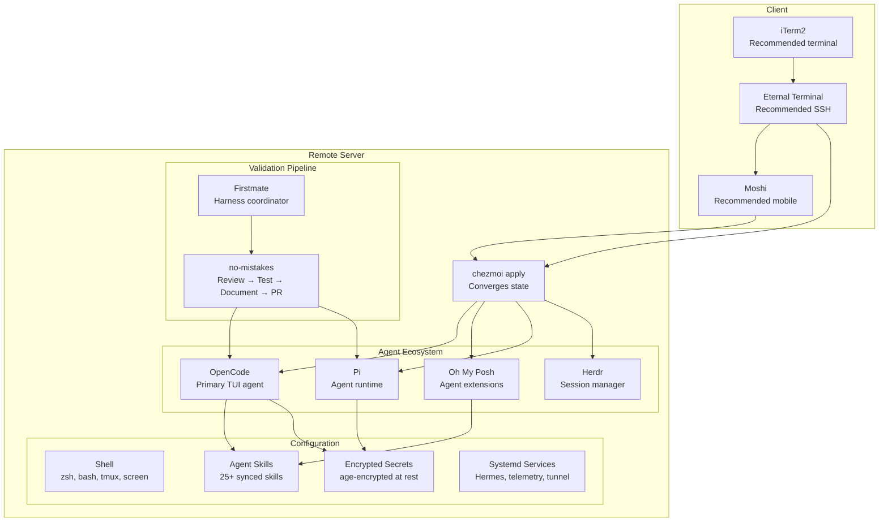

# dotfiles

Chezmoi-managed dotfiles that drive a **standardized AI-agent environment** across remote headless servers. Single source of truth for shell, editor, and agent configs — every machine converges to the same state on `chezmoi apply`.

## Why

Remote headless servers need consistent, reproducible environments for AI coding agents. This repo ensures opencode, omp, pi, and their subagents all behave identically regardless of which box you SSH into — same models, same skills, same secrets, same supervision.

## Architecture



## Recommended Stack

| Tool | Why |
|------|-----|
| **iTerm2** | Best TUI rendering for agent interfaces, proper Unicode support, split panes for parallel agent work |
| **Eternal Terminal** | Survives network drops and server reboots without losing your session — essential for long-running agent workflows |
| **Moshi** | Access agent sessions from your phone; web-based, no server-side app install needed |

## What's Managed

| Category | Components |
|----------|-----------|
| **Shell** | zsh, bash, tmux, screen, git |
| **Agent Runtime** | OpenCode (50+ subagents, themes), Pi, Oh My Posh extensions, Herdr |
| **Agent Skills** | 25+ synced skills (CE suite, AXI tools, Cloudflare, debugging, design) |
| **Secrets** | All provider keys age-encrypted (Google, Cloudflare, Composio, Telegram, etc.) |
| **Systemd** | Hermes, Honcho, catalog drift, self-improvement, telemetry, Cloudflare tunnel |
| **SSH** | 6+ key pairs, all age-encrypted |

## Agent Harness

**Firstmate** is recommended as the harness coordinator for multi-agent workflows. It orchestrates agent spawning, background task supervision, away-mode daemon for token-efficient unattended operation, and fleet state tracking across parallel workers.

## Validation Pipeline

**no-mistakes** is imposed on this repo. Every change goes through automated review, testing, documentation, and PR creation — ensuring no broken config ships to production machines.

## Quick Start

```bash
# On a new machine
curl -fsSL https://get.chezmoi.io | sh
chezmoi init --apply phillias
```

This clones the repo, applies all configs, installs age keys, and sets up agent environments.

## Secrets

All sensitive values are age-encrypted at rest. The age key itself is stored encrypted in `age-key.txt.age` and decrypted during `chezmoi apply` using the machine's identity.

```bash
chezmoi add --encrypt ~/.config/some-app/token
```

## Machine Identity

Each machine gets its own identity via `.chezmoi.toml.tmpl` which generates machine-specific configs during apply using `chezmoi.user.name`, `chezmoi.user.email`, `chezmoi.os`, and `chezmoi.arch`.

## Contributing

1. Branch off master
2. Make changes
3. Test with `chezmoi diff` and `chezmoi verify`
4. Commit through no-mistakes pipeline
5. Open PR
6. Merge when CI passes

## License

Personal use only.

## Validation

Run `scripts/validate.sh` before shipping dotfiles changes (wired for the no-mistakes test/lint steps): renders every `.tmpl`, parses `opencode.json` and `dispatch-rules.json`, prints `chezmoi doctor` informationally.
