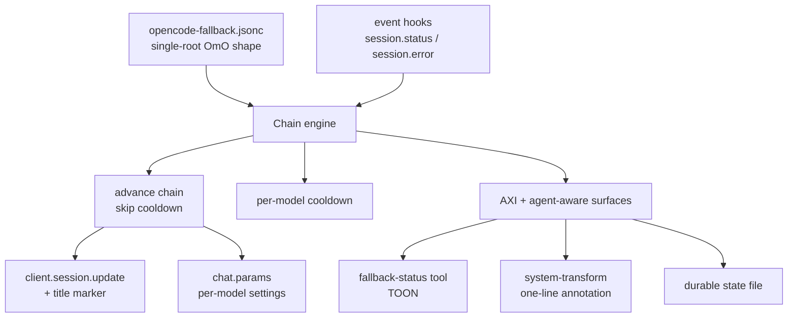
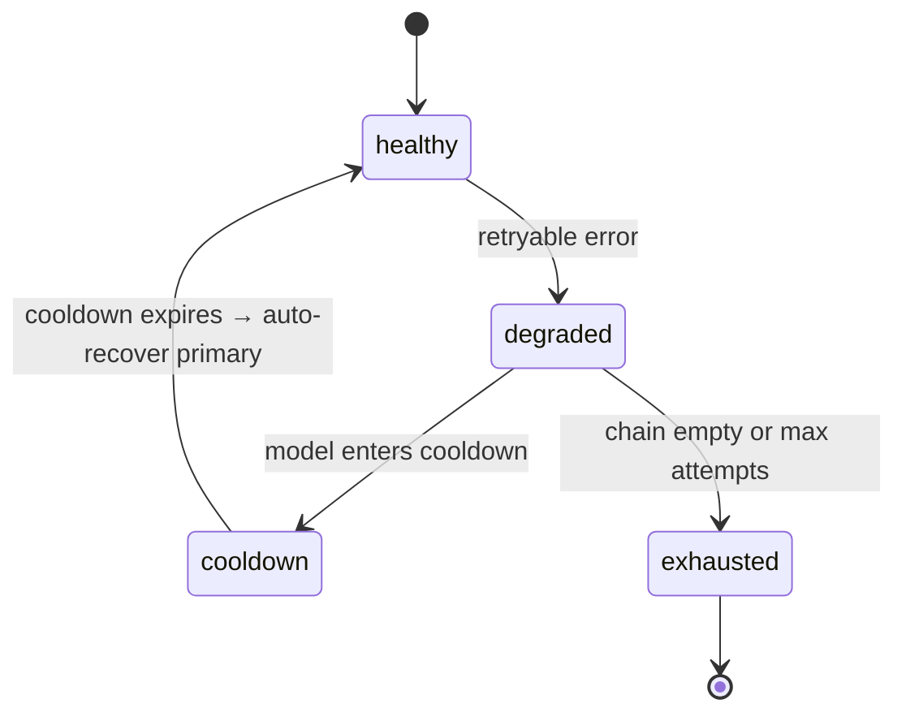

# OpenCode Configuration Skill

## Purpose

This skill documents the architecture, decisions, and maintenance procedures for the OpenCode configuration on this home: the provider stack, model catalog, fallback system, drift pipeline, and per-provider gotchas.

**OmO is retired (2026-08-09).** The Oh-My-OpenAgent plugin was purged from `opencode.json` and `node_modules`; its recovered config (`~/.omo/omo.jsonc`, migration `2026-07-opencode-config-unification`) seeded the local `opencode-fallback.jsonc` ladder and remains only as provenance. All fallback behavior is now implemented by the local `opencode-runtime-fallback.ts` plugin. This skill was renamed from `opencode-omo-config` to `opencode-config` on 2026-08-09 to reflect that OmO is no longer part of the config. Historical OmO-era notes below are retained as accurate history, not current runtime state.

As of 2026-07-18, this is a single-root config — profiles were phased out after they were identified as the source of the `cloudflare/` vs `@cf/` prefix bug (root config was correct, profiles shadowed it with bare model names).

## Model Specifications

### OpenCode Zen (47 models)

| Model | Context | Output | Temp |
|-------|---------|--------|------|
| big-pickle | 200K | 32K | 0.7 |
| kimi-k2.6 | 200K | 32K | 0.7 |
| deepseek-v4-pro | 131K | 8K | 1.0 |
| deepseek-v4-flash | 131K | 8K | 0.7 |
| gpt-5.5 | 128K | 32K | 0.7 |
| gpt-5.4 | 128K | 32K | 0.7 |
| claude-opus-4-8 | 200K | 32K | 0.7 |
| gemini-3.5-flash | 1M | 64K | 0.7 |
| nemotron-3-ultra-free | 262K | 8K | 0.7 |
| deepseek-v4-flash-free | 131K | 8K | 0.7 |

### Cloudflare Workers AI (34 LLM models; 77 total in catalog — 2026-08-04)

User subscribes to Cloudflare Workers. Catalog scraped from developers.cloudflare.com/workers-ai/models: 77 total = 34 text-gen/chat/vision LLMs, 5 embeddings (bge-*, qwen3-embedding-0.6b, plamo-embedding-1b, embeddinggemma-300m), 1 reranker (bge-reranker-base), 3 TTS (melotts, deepgram aura-*), 3 speech (whisper*, deepgram nova-3), 2 translation (m2m100, indictrans), 2 safety (llama-guard-3-8b), ~24 image/other (flux-*, stable-diffusion-*, dreamshaper, lucid-origin, phoenix, llava, moondream).

⚠️ = context not yet verified against CF docs; confirm before relying on it for routing.

| Model | Context | Output | Temp | Notes |
|-------|---------|--------|------|-------|
| @cf/meta/llama-3.3-70b-instruct-fp8-fast | 24K | 8K | 0.7 | free-tier leader |
| @cf/meta/llama-4-scout-17b-16e-instruct | 131K | 8K | 0.7 | |
| @cf/meta/llama-3.1-70b-instruct | 128K | 8K | 0.7 | |
| @cf/meta/llama-3.1-8b-instruct | 128K | 8K | 0.7 | +awq/fast/fp8 variants |
| @cf/meta/llama-3.2-3b-instruct | 128K | 8K | 0.7 | cheap tier |
| @cf/meta/llama-3.2-1b-instruct | 128K | 8K | 0.7 | cheapest |
| @cf/meta/llama-3-8b-instruct | 8K | 8K | 0.7 | legacy (+awq) |
| @cf/deepseek-ai/deepseek-r1-distill-qwen-32b | 80K | 8K | 1.0 | reasoning |
| @cf/qwen/qwen2.5-coder-32b-instruct | 32K | 8K | 0.7 | |
| @cf/qwen/qwen3-30b-a3b-fp8 | 32K | 8K | 0.7 | |
| @cf/qwen/qwq-32b | 131K⚠️ | 8K | 0.7 | NEW — reasoning |
| @cf/openai/gpt-oss-120b | 128K | 8K | 0.7 | |
| @cf/openai/gpt-oss-20b | 128K | 8K | 0.7 | |
| @cf/moonshotai/kimi-k2.6 | 262K | 8K | 0.7 | |
| @cf/moonshotai/kimi-k2.7-code | 262K | 8K | 0.7 | coding |
| @cf/moonshotai/kimi-k2.5 | 131K⚠️ | 8K | 0.7 | NEW |
| @cf/zai-org/glm-4.7-flash | 131K | 8K | 0.7 | |
| @cf/zai-org/glm-5.2 | 262K | 8K | 0.7 | |
| @cf/google/gemma-4-26b-a4b-it | 256K | 8K | 0.7 | thinking model |
| @cf/google/gemma-3-12b-it | 128K⚠️ | 8K | 0.7 | NEW |
| @cf/aisingapore/gemma-sea-lion-v4-27b-it | 32K⚠️ | 8K | 0.7 | NEW |
| @cf/nvidia/nemotron-3-120b-a12b | 256K | 8K | 0.7 | |
| @cf/mistralai/mistral-small-3.1-24b-instruct | 128K⚠️ | 8K | 0.7 | NEW |
| @cf/ibm-granite/granite-4.0-h-micro | 131K⚠️ | 8K | 0.7 | NEW |
| @cf/meta/llama-3.2-11b-vision-instruct | 128K⚠️ | 8K | 0.7 | vision |
| @cf/meta/llama-guard-3-8b | 8K⚠️ | — | — | safety |
| @cf/microsoft/phi-2 | 2K⚠️ | — | — | legacy |
| @cf/mistral/mistral-7b-instruct-v0.1 | 8K⚠️ | — | — | legacy |

### Agnes AI (5 models)

| Model | Context | Output | Temp |
|-------|---------|--------|------|
| agnes-1.5-flash | 131K | 8K | 0.7 |
| agnes-2.0-flash | 131K | 8K | 0.7 |
| agnes-video-v2.0 | 32K | 4K | 0.7 |
| agnes-image-2.1-flash | 32K | 4K | 0.7 |
| agnes-image-2.0-flash | 32K | 4K | 0.7 |

### OpenRouter (24 models)

| Model | Context | Output | Temp |
|-------|---------|--------|------|
| qwen/qwen3-coder:free | 131K | 8K | 0.7 |
| meta-llama/llama-3.3-70b-instruct:free | 131K | 8K | 0.7 |
| nvidia/nemotron-3-super-120b-a12b:free | 131K | 8K | 0.7 |
| poolside/laguna-s-2.1:free | 262K | 8K | 0.7 | NEW — 118B MoE, 8B active, agentic coding specialist |
| openai/gpt-4o | 128K | 16K | 0.7 |
| google/gemini-2.5-flash | 1M | 64K | 0.7 |
| deepseek/deepseek-chat | 131K | 8K | 0.7 |

### OpenCode Go (12 models)

| Model | Context | Output | Temp |
|-------|---------|--------|------|
| kimi-k2.6 | 200K | 32K | 0.7 |
| deepseek-v4-pro | 131K | 8K | 1.0 |
| deepseek-v4-flash | 131K | 8K | 0.7 |
| glm-5.1 | 131K | 8K | 0.7 |

### Other Providers

| Provider | Model | Context | Output | Temp |
|----------|-------|---------|--------|------|
| Google | gemini-2.0-flash | 1M | 8K | 0.7 |
| Mistral | mistral-large-latest | 131K | 8K | 0.7 |
| SambaNova | Meta-Llama-3.3-70B-Instruct | 131K | 8K | 0.7 |
| Together | deepseek-ai/DeepSeek-R1 | 163K | 163K | 1.0 |
| Together | Prism-ML/Ternary-Bonsai-27B | 262K | 8K | 0.7 | FREE — 1.58-bit ternary, vision + tools. ⚠️ TOOL-LOOP FAILURE: single-shot only (see Known Failure) |
| InternLM | intern-s2-preview-397b | 256K | 8K | 0.7 | NEW — 397B MoE, scientific reasoning, Apache 2.0 |
| HuggingFace | openai/gpt-oss-120b | 128K | 32K | 0.7 |
| HuggingFace | openai/gpt-oss-20b | 128K | 16K | 0.7 |
| HuggingFace | deepseek-ai/DeepSeek-V4-Flash | 1024K | 16K | 0.7 |
| HuggingFace | deepseek-ai/DeepSeek-V4-Pro | 1024K | 32K | 0.7 |
| HuggingFace | Qwen/Qwen3-Coder-480B-A35B-Instruct | 262K | 32K | 0.7 |
| HuggingFace | Qwen/Qwen3-235B-A22B-Instruct-2507 | 262K | 8K | 0.7 |
| HuggingFace | google/gemma-4-26B-A4B-it | 256K | 32K | 0.7 |
| HuggingFace | meta-llama/Llama-3.3-70B-Instruct | 128K | 16K | 0.7 |
| HuggingFace | deepseek-ai/DeepSeek-R1-0528 | 160K | 8K | 1.0 |
| MindLab | Macaron-V1-Preview-749B | 202K | 8K | 0.7 | NEW — 749B-class Mixture-of-LoRA personal-agent (GLM-5.1 base), MIT, HF weights + harness only — NO hosted API (see Recently Added Models) |

### NVIDIA NIM (118 models, 48 relevant — FREE for prototyping)

**Cost**: Free for prototyping via NVIDIA Developer Program. No per-token pricing published.
**Rate limit**: ~40 RPM shared across ALL models (community-acknowledged baseline, not published SLA). No daily token cap.
**Production**: NVIDIA AI Enterprise from $4,500/GPU/year. Free 90-day evaluation available.
**Key file**: `.nvidia-key` → `NVIDIA_API_KEY`
**Verified via API**: 2026-07-23, 118 total models on `integrate.api.nvidia.com/v1/models`

#### Flagship Models (free, highest value for fallback chains)

| Model ID | Category | Context | Notes |
|----------|----------|---------|-------|
| `nvidia/nemotron-3-ultra-550b-a55b` | Agentic/Reasoning | 202K | Flagship MoE, 550B total / 55B active |
| `nvidia/nemotron-3-super-120b-a12b` | Agentic/Coding | 202K | Strong coding + reasoning MoE |
| `nvidia/nemotron-3-nano-30b-a3b` | Lightweight | 202K | Edge-tier MoE, 30B total / 3B active |
| `nvidia/nemotron-3-nano-omni-30b-a3b-reasoning` | Reasoning | 202K | Omni-modal reasoning variant |
| `deepseek-ai/deepseek-v4-pro` | Frontier Reasoning | 1024K | 1.6T MoE, 49B active |
| `deepseek-ai/deepseek-v4-flash` | Fast Coding | 131K | Speed-optimized variant |
| `z-ai/glm-5.2` | Agentic/Coding | 524K | SWE-bench leader |
| `moonshotai/kimi-k2.6` | Agentic/Coding | 262K | Long-horizon problem solving |
| `qwen/qwen3.5-397b-a17b` | Vision/Chat | 262K | MoE, vision-capable |
| `qwen/qwen3-next-80b-a3b-instruct` | Lightweight MoE | 128K | 80B total / 3B active |
| `openai/gpt-oss-120b` | General Purpose | 128K | OpenAI's open-source 120B |
| `openai/gpt-oss-20b` | Fast General | 128K | Lightweight open-source |
| `thinkingmachines/inkling` | 1M Context | 1048K | Multimodal, Apache 2.0 |
| `google/gemma-4-31b-it` | Vision | 256K | Multimodal MoE |
| `minimaxai/minimax-m2.7` | Reasoning | 128K | |
| `minimaxai/minimax-m3` | Reasoning | 128K | |
| `mistralai/mistral-nemotron` | Agentic/Coding | 128K | Mistral × NVIDIA collab |
| `meta/llama-4-maverick-17b-128e-instruct` | Chat | 128K | Meta MoE |

#### Utility/Embedding Models (free, specialized)

| Model ID | Category | Notes |
|----------|----------|-------|
| `nvidia/llama-nemotron-embed-1b-v2` | Embeddings | |
| `nvidia/llama-nemotron-embed-vl-1b-v2` | Vision Embeddings | |
| `nvidia/nemotron-3-embed-1b` | Embeddings | |
| `nvidia/nemotron-nano-12b-v2-vl` | Vision | |
| `nvidia/llama-3.1-nemotron-nano-vl-8b-v1` | Vision | |
| `nvidia/nemotron-parse` | Document parsing | |
| `nvidia/nemotron-3.5-content-safety` | Moderation | |
| `nvidia/llama-3.1-nemotron-safety-guard-8b-v3` | Safety | |

#### Rate Limit Details

- **Shared limit**: ~40 RPM across ALL models for a single API key
- **Not per-model**: All model calls combined cannot exceed the limit
- **Model-dependent ceiling**: Your exact limit is shown in build.nvidia.com account panel
- **No daily token cap**: Only RPM is limited
- **No SLA**: "Dependent on model, use-case and the amount of current overall traffic"
- **Recommendation**: Set `providerConcurrency.nvidia: 4` to stay well under 40 RPM with burst headroom

### Baseten (13 models — PAY-PER-TOKEN with $30 free credits)

**Cost**: Pay-per-token. $30 free credits for new workspaces (no credit card required).
**Rate limit**: 15 RPM (unverified) / 120 RPM (verified) per workspace.
**Startup program**: Up to $25,000 credits (Dedicated Inference) + $2,500 (Model APIs) for seed–Series A.
**Key file**: `.baseten-key` → `BASETEN_API_KEY`
**Verified via API**: 2026-07-23, 13 models on `inference.baseten.co/v1/models`

#### Full Model Catalog with Pricing

| Model ID | Name | Context | Max Output | In $/M | Out $/M | Cache $/M | Features |
|----------|------|---------|------------|--------|---------|-----------|----------|
| `openai/gpt-oss-120b` | GPT-OSS 120B | 128K | 128K | **$0.10** | **$0.50** | $0.10 | tools, reasoning, json_mode, structured_outputs |
| `nvidia/Nemotron-120B-A12B` | Nemotron Super | 202K | 202K | **$0.30** | **$0.75** | $0.06 | tools, json_mode, structured_outputs, reasoning |
| `zai-org/GLM-4.7` | GLM 4.7 | 200K | 200K | $0.60 | $2.20 | $0.12 | tools, json_mode, structured_outputs |
| `moonshotai/Kimi-K2.5` | Kimi K2.5 | 262K | 262K | $0.60 | $3.00 | $0.12 | tools, json_mode, structured_outputs, vision |
| `nvidia/NVIDIA-Nemotron-3-Ultra-550B-A55B` | Nemotron Ultra | 202K | 202K | $0.60 | $2.40 | $0.12 | tools, json_mode, structured_outputs, reasoning |
| `zai-org/GLM-5` | GLM 5 | 202K | 202K | $0.95 | $3.15 | $0.20 | tools, json_mode, structured_outputs |
| `moonshotai/Kimi-K2.6` | Kimi K2.6 | 262K | 262K | $0.95 | $4.00 | $0.16 | tools, json_mode, structured_outputs, reasoning |
| `moonshotai/Kimi-K2.7-Code` | Kimi K2.7 Code | 262K | 262K | $0.95 | $4.00 | $0.16 | tools, json_mode, structured_outputs, reasoning |
| `thinkingmachines/inkling` | Inkling | **1048K** | 32K | $1.00 | $4.05 | $0.17 | tools, json_mode, structured_outputs, reasoning |
| `zai-org/GLM-5.1` | GLM 5.1 | 202K | 202K | $1.30 | $4.30 | $0.26 | tools, json_mode, structured_outputs |
| `zai-org/GLM-5.2` | GLM 5.2 | **524K** | **524K** | $1.40 | $4.40 | $0.14 | tools, json_mode, structured_outputs, reasoning |
| `deepseek-ai/DeepSeek-V4-Pro` | DeepSeek V4 Pro | 262K | 262K | $1.74 | $3.48 | $0.14 | tools, json_mode, structured_outputs, reasoning |
| `zai-org/GLM-5.2-Fast` | GLM 5.2 Fast | **524K** | **524K** | $2.10 | $6.60 | $0.21 | tools, json_mode, structured_outputs, reasoning |

#### Rate Limit Details

| Account Type | RPM | TPM |
|---|---|---|
| Basic (unverified) | 15 | 100,000 |
| Basic (verified) | 120 | 500,000 |
| Pro | 120 | 1,000,000 |
| Enterprise | Custom | Custom |

#### Best Value Picks (for fallback chain placement)

1. **`openai/gpt-oss-120b`** — $0.10/$0.50 per 1M tokens. Cheapest general-purpose model. 128K context.
2. **`nvidia/Nemotron-120B-A12B`** — $0.30/$0.75. Strong coding + reasoning at budget price. 202K context.
3. **`thinkingmachines/inkling`** — $1.00/$4.05. **1M context window** — unique capability. Multimodal.
4. **`zai-org/GLM-5.2`** — $1.40/$4.40. **524K context**, reasoning. SWE-bench leader.

### CheapestInference (cheapestinference.com) — flat-rate unlimited time-block subscriptions

Investigated 2026-08-04 (live site + docs; API not probed — no key). **Not a reseller** — a cooperative-style pool operator serving open-weight models with **unlimited tokens during reserved daily 8-hour UTC time blocks** for a flat monthly fee. No per-token billing, no token counting, no overage. Open-source models only.

**Cost**: Flat monthly per daily 8-hour UTC block. Reserve 1–3 blocks (`asia` 00:00–08:00, `europe` 08:00–16:00, `americas` 16:00–24:00); all three = 24/7 (≈$177/mo Frontier, ≈$38/mo Core). Annual billing = −15%. **Price lock**: renewals never cost more; price drops pass through automatically. Payment: Stripe card (auto-renew, cancel anytime); USDC on Base + x402 agent self-subscription **temporarily paused**.

| Pool | Models | Price per 8h block | Annual (−15%) |
|------|--------|--------------------|---------------|
| **Flagship** | Kimi K3 (solo) | $149–165/mo | from $126.65/mo — **sold out, very limited seats** |
| **Frontier** | Kimi K2.7, GLM 5.2, MiniMax M3 | $57–61/mo | from $48.45/mo |
| **Core** | DeepSeek V4 Flash, MiMo v2.5 | $14.99–19.99/mo | from $12.74/mo |

**Rate limits**: Unlimited tokens in-window — **no RPM cap, no daily quota, no monthly budget**. But **1 concurrent request per key** (fair use). Scale parallelism by buying more seats/subscriptions and combining keys (coverage windows add up; overlapping hours stack capacity). **Outside reserved blocks the key serves nothing** — availability is time-block-restricted.

**Key file**: `.cheapestinference-key` → `CHEAPESTINFERENCE_API_KEY` (documented convention — **NOT created or wired into `opencode.json`**)

**Endpoints**: OpenAI `https://api.cheapestinference.com/v1` (chat/completions, models, usage) + Anthropic `https://api.cheapestinference.com/anthropic/v1/messages`. Drop-in for Claude Code, Cline, Roo Code. Tools/function-calling verified against live API per vendor docs. Management API mints keys/subscriptions programmatically; MCP server available.

#### Model Catalog (3 pools, 6 models)

| Model | Pool | Model ID | Context | Cost basis in/out $/1M |
|-------|------|----------|---------|------------------------|
| Kimi K3 (Moonshot flagship) | Flagship | `kimi-k3` | 256K | $3.00 / $15.00 |
| Kimi K2.7 | Frontier | `kimi-k2.7` | 256K | $0.45 / $2.25 |
| GLM 5.2 | Frontier | `glm-5.2` | 198K | $1.40 / $4.40 |
| MiniMax M3 | Frontier | `minimax-m3` | 1M | $0.60 / $2.40 |
| DeepSeek V4 Flash | Core | `deepseek-v4-flash` | 1M | $0.14 / $0.28 |
| MiMo v2.5 (Xiaomi) | Core | `mimo-v2.5` | ~1M | $0.14 / $0.28 |

**⚠️ Verification needed before wiring**: max output tokens per model (undocumented — pull `GET /v1/models`), temperature support, tool-loop reliability under agentic load, live pool lineup. **Lineup churns**: K2.6 retired July 2026; Infrabase snapshot (June 2026) showed an earlier lineup (K2.6/GLM 4.7/MiniMax M2.5 @ $33.15/mo) — prices and models moved since.

**Placement advice**: 🔴 pay-tier flat-rate option for **high-volume, low-parallelism** agents (explore, librarian, quick, sisyphus-junior) that burn frontier tokens past free-tier rate limits. **Concurrency-1 serializes subagent swarms — never a team-mode/oracle/momus primary.** Buy only the Americas block (16–24 UTC ≈ 12pm–8pm ET) for dev-hour coverage. Counterparty risk: young indie (since Sept 2025), hidden WHOIS, no published SLA, Scamadviser "average trust" — trial Core ($14.99) before Frontier.

### Cheaper Inference (cheaperinference.com) — Keak discounted-capacity reseller

Investigated 2026-08-04 (live site + docs; API not probed — no key). **A Keak company** (keak.com). Buys excess committed inference capacity from AI companies (sellers include OpenAI, Anthropic, Google, xAI, AWS Bedrock, Azure AI, OpenRouter) and resells it at **up to 30% below direct list price — never above list**, no routing surcharge. **Serves proprietary models (Claude, GPT, Kimi K3) — unique among the 15-provider stack.**

**Cost**: Usage-based pay-per-token, no contract, no monthly commitment. Wallet-funded: min **$5**, **+$10 bonus on first funding** ($15 usable). Stripe; auto-recharge optional. Referral program ($10/$10). No free tier.

**Rate limits**: **Per-key configurable** — model allowlist, IP/CIDR restriction, expiration, **RPM, concurrent requests, daily quota, monthly budget**. Gateway retries network failures + 404/408/409/425/429/5xx once, then reroutes in **price order** across eligible providers (API-level fallback, complementary to OmO `runtime_fallback`). `402` = insufficient wallet (OmO `retry_on_errors` already includes 402 → clean fallthrough). No SLA published; support <12h; status at `platform.keak.com/status`; Trust Center + DPA + subprocessor list.

**Privacy boundary**: prompts not stored in app DB, but **forwarded to the serving provider** — weaker than CheapestInference's in-memory open-source story.

**Key file**: `.cheaperinference-key` → `CHEAPER_INFERENCE_API_KEY` (documented convention — **NOT created or wired into `opencode.json`**)

**Endpoints**: OpenAI `https://api.cheaperinference.com/v1` (chat/completions, responses, completions, images/generations, uploads, models, pricing/changes) + Anthropic-compatible Messages. Keys `ir_live_` prefix. Vision input: up to 10 images / 5MB each / 23MB decoded total; temp uploads for large payloads. Prompt caching passed through with provider-specific cache rates.

#### Models (live catalog — partial list from docs)

| Model | Type | Notes |
|-------|------|-------|
| `claude-opus-4.6` | text | Proprietary Claude — per-token access without subscription |
| `gpt-5.4` | text | Example catalog rate $1.25 in / $10.00 out per 1M; cache-read $0.125 (10%) |
| `kimi-k3` | text | `reasoning: {"effort": low\|high\|max}` — no `medium` |
| `nano-banana-pro` | image | Fixed output-token per resolution (1,120 @ 1K/2K, 2,000 @ 4K) |
| `grok-imagine` | image | `/v1/images/generations` only |

**⚠️ Verification needed before wiring**: full `/v1/models` catalog (context/output limits per model, actual discounts), settled-rate vs cached-rate delta, tool-loop reliability. Rates are **market-linked**: final charge can differ from the cached rate (docs: "do not treat a locally cached rate as the final charge") — reconcile via `pricing_version` / `pricing_checked_at` / `pricing_updated_at` response fields and the `pricing/changes` feed.

**Placement advice**: the stack's best **budget pay-tier** — per-token frontier (Claude/GPT-class) with hard key-level budget caps and real company backing. Fits `fallback_models` for oracle/momus/hephaestus (frontier reasoning when the opencode subscription pool is throttled) and visual-engineering (image gen) — *after* free tiers, alongside Baseten/Go. NOT for high-volume utility agents (per-token accrues; free tiers win). Not a replacement for CheapestInference's flat-rate volume economics.

### Free→Subsidized→Pay Value Analysis

**Priority ranking for fallback chain placement (exhaust free → subsidized → pay):**

| Tier | Provider | Models | Cost | RPM | Best For |
|------|----------|--------|------|-----|----------|
| 🟢 **FREE** | NVIDIA NIM | 48 relevant | $0 | ~40 shared | Largest free catalog, 1M ctx (Inkling), reasoning (Nemotron Ultra) |
| 🟢 **FREE** | Cloudflare Workers AI | 34 LLM / 77 total | $0 | 300 req/min | Free-tier leader, GPT-OSS, Kimi K2.6/K2.7/K2.5, GLM 5.2, QwQ-32B, Llama 3.x, Nemotron 3, Gemma 4/3 |
| 🟢 **FREE** | OpenRouter | 6 free | $0 | 50 req/day | Nemotron Super/Nano, Qwen3 Coder |
| 🟢 **FREE** | OpenCode Zen | 6 free | $0 | ~200 req/day | Nemotron Ultra, DeepSeek V4 Flash, MiMo |
| 🟢 **FREE** | Together AI | 2 (DS-R1 + Bonsai 27B) | $0 | 60 RPM, 60K TPM | DeepSeek R1 (reasoning), **Ternary Bonsai 27B (262K ctx, vision, tools) ⚠️ single-shot only — tool-loop failure** |
| 🟡 **SUBSIDIZED** | Baseten | 13 | $30 credits | 15-120 | GPT-OSS 120B at $0.10/M, Inkling at 1M ctx |
| 🟡 **SUBSIDIZED** | OpenCode Go | 24 | $10/mo | — | Quality pool (K2.6, DS-V4, GLM-5.1) |
| 🔴 **PAY** | Google | 1 | Pay-per-token | 1500/day | Gemini 2.0 Flash, 1M ctx, last resort |
| 🔴 **PAY** | Together | 1 | Pay-per-token | 60+ | DeepSeek R1, reasoning specialist |
| 🔴 **PAY** | CheapestInference | 6 (3 pools) | Flat $12.74–149/mo per 8h block | Unlimited in-window, 1 req/key | Open-model unlimited — DS-V4 Flash/K2.7/GLM 5.2/MiniMax M3 (1M ctx) |
| 🔴 **PAY** | Cheaper Inference (Keak) | 5+ (live catalog) | Per-token ≤30% off list | Per-key configurable | Proprietary Claude/GPT per-token, image gen, budget caps |

**Key insight**: NVIDIA NIM provides the **largest free model catalog** (48 relevant models at $0) with a shared ~40 RPM limit. This should be inserted into fallback chains **after** Cloudflare (which has higher RPM at 300 req/min) but **before** OpenRouter free (which has only 50 req/day). Baseten's $30 credits + $0.10/M GPT-OSS 120B provides a cheap subsidized tier between free and full-pay.

**DeepSeek V4 availability**: Only 2 providers offer DS-V4 for free — NVIDIA NIM (both Flash and Pro) and OpenCode Zen (Flash Free only). OpenRouter's `:free` listing is dead (endpoints: [], 0% availability). Add both NIM and Zen DS-V4 models to fallback chains for resilience — they have independent rate limits.

**Recommended fallback chain order**:
1. Cloudflare Workers AI (free, 300 RPM)
2. Together AI (free, 60 RPM — Bonsai 27B for 262K ctx + vision, DS-R1 for reasoning) — ⚠️ Bonsai single-shot only, never as agent primary
3. NVIDIA NIM (free, ~40 RPM shared — use 1-2 models max to stay under limit)
4. OpenRouter free (50 req/day)
5. OpenCode Zen free (200 req/day)
6. Baseten ($30 credits → $0.10/M GPT-OSS 120B)
7. OpenCode Go ($10/mo pool)
8. Google Gemini (pay, last resort)

**New pay-tier additions (2026-08-04 investigation)**: **CheapestInference** (flat-rate unlimited) and **Cheaper Inference** (Keak, discounted per-token) both slot at the 🔴 PAY end of the ladder — as *alternatives to* Baseten/Go depending on workload shape (see their sections): flat-rate wins for sustained frontier-model volume; discounted per-token wins for bursty proprietary-model access with budget caps. Neither has a free tier; neither changes the free→subsidized ordering above. Neither is wired into `opencode.json` yet — documentation only.

### Recently Added Models (2026-07-24)

#### Laguna S 2.1 (Poolside) — Agentic Coding Specialist

| Spec | Value |
|------|-------|
| Total Params | 118B (MoE) |
| Active Params | 8B per token |
| Context | 262K (free) / 1M (paid) |
| License | OpenMDW-1.1 |
| Provider | OpenRouter (`poolside/laguna-s-2.1:free`) |
| Pricing | Free (262K ctx) / $0.10 input, $0.20 output (1M ctx) |
| Benchmarks | Terminal-Bench 2.1: 70.2%, SWE-bench: 78.5% |
| Placement | Free tier in explore, librarian, quick, unspecified-low, global fallback |

#### Intern-S2-Preview-397B (InternLM) — Scientific Reasoning

| Spec | Value |
|------|-------|
| Total Params | 397B (MoE) |
| Active Params | ~120B per token |
| Context | 256K |
| License | Apache 2.0 |
| Provider | InternLM API (`chat.intern-ai.org.cn`) — NEW provider |
| Pricing | Free (official API) |
| Capabilities | Multimodal (vision + text), scientific reasoning, agent workflows |
| Placement | Oracle, deep, unspecified-high (reasoning-heavy agents) |

#### Ternary Bonsai 27B (PrismML) — 1.58-bit Ternary LLM

| Spec | Value |
|------|-------|
| Base model | Qwen3.6-27B (hybrid attention: ~75% linear, ~25% full) |
| Parameters | 27.3B ternary language + ~461M vision tower (4-bit) |
| Weight format | Ternary g128: {-1, 0, +1} with FP16 group-wise scaling (1.71 bpw) |
| Context | 262K tokens |
| Max output | 8K tokens (Together API default) |
| Modalities | Text + image in, text out |
| Vision tower | HQQ 4-bit, ~0.63 GB, loaded only for image input |
| KV cache | Near-lossless 4-bit quantization, ~4.3 GB at 262K window |
| Deployed size | ~7.2 GB (ternary), ~3.9 GB (1-bit variant) |
| License | Apache 2.0 |
| Provider | Together AI (`Prism-ML/Ternary-Bonsai-27B`) — **FREE** |
| Pricing | $0.00/1M tokens (input and output) |
| Rate limit | Together free tier: 60 RPM, 60K TPM (shared across all models) |
| Capabilities | tools ✅, json_mode ✅, reasoning ✅, vision ✅, structured_outputs ✅ |
| Recommended sampling | temperature 0.7, top_p 0.95, top_k 20 |
| Self-host option | GGUF Q2_0 (6.66 GiB) or MLX 2-bit (7.05 GiB) via HuggingFace |
| Throughput (local) | ~134 tok/s ternary on RTX 5090, ~58 tok/s on M5 Max |
| Benchmark avg | 80.49 (thinking mode, 15 benchmarks) — 94.6% of FP16 baseline |
| Math | 93.40 (within 2 pts of FP16) |
| Coding | 85.96 |
| Agentic tool use | 74.01 (benchmark score — does NOT reflect real-world loop behavior, see Known Failure below) |
| Vision | 65.19 |
| Placement | **RESTRICTED — single-shot/non-agent calls only** (see Known Failure). Was Explore/Librarian primary; reverted 2026-07-31 |

**⚠️ KNOWN FAILURE — DO NOT USE AS PRIMARY FOR TOOL-LOOP AGENTS (2026-07-31)**

Empirically verified failure in the Librarian agent:

- **Symptom**: When a tool call fails (error, empty result, dead endpoint), the model
  **repeats the SAME call** instead of synthesizing a different approach. It pattern-matches
  "call tool" without reading the error context.
- **Root cause**: 1.58-bit ternary quantization preserves static knowledge benchmarks
  (~94.6% of FP16) but degrades the *agentic* capability benchmarks don't measure:
  error-context parsing + alternative-plan generation. The `Agentic tool use 74.01`
  score is a static benchmark, not evidence of loop behavior.
- **Impact**: A dispatch can burn the whole fallback chain re-hitting the same failed
  endpoint, or terminate with a repeated-call loop instead of a research answer.
- **Status**: Reverted from Librarian primary → `opencode-zen/deepseek-v4-flash-free`
  (131K, FREE, reliable tool recovery — the documented llama-3.3-70b replacement, line 836).
- **Rule**: Never place in primary/early-fallback of any agent that iterates tool calls
  (librarian, explore, quick, unspecified-low). Safe for SINGLE-SHOT calls with no loop:
  vision `look_at`, title generation, compaction, global-chain safety net for non-agent use.

#### Ternary Bonsai 8B/4B/1.7B (PrismML) — Compact Ternary Family

| Model | Params | Context | Ternary Size | Avg Benchmark | Provider |
|-------|--------|---------|-------------|---------------|----------|
| Ternary-Bonsai-8B | 8.19B | 65K | 1.75 GB | 75.5 | Self-host only (MLX/GGUF) |
| Ternary-Bonsai-4B | 4.0B | 32K | 0.86 GB | 70.7 | Self-host only (MLX/GGUF) |
| Ternary-Bonsai-1.7B | 1.72B | 32K | 0.37 GB | — | Self-host only (MLX/GGUF) |

**Self-host note**: The smaller Bonsai models (8B, 4B, 1.7B) are NOT available on Together AI or any hosted provider. They require local deployment via llama.cpp (GGUF) or MLX. The 8B at 1.75 GB fits on any machine with 4GB+ free RAM. Useful for offline/airgapped utility agents if self-hosted.

#### Macaron-V1-Preview-749B (MindLab Research) — Personal-Agent MoL Specialist

Captured 2026-07-31 from model card + config.json (weights verified on HF).

| Spec | Value |
|------|-------|
| Total Params | 749B-class Mixture-of-LoRA: 744B base (GLM-5.1) + 5 × ~1B LoRA adapters (`l0`–`l4`) |
| Active Params | 8 routed experts per token (256 routed + 1 shared expert, MoE) |
| Architecture | `glm_moe_dsa` (DeepSeek-style sparse-attention MoE), 78 layers, hidden 6144, head_dim 64, qk_head_dim 256, vocab 154,880 |
| Context | 202,752 tokens (from `config.json` / `tokenizer_config.json`) |
| Precision | bfloat16 |
| License | MIT (respect inherited GLM-5.1 base terms) |
| Languages | en, zh |
| Post-training | MinT system |
| Provider | **HuggingFace weights ONLY** (`mindlab-research/Macaron-V1-Preview-749B`) — **NO hosted API** (not on OpenRouter's 336 models, CF, NIM, Baseten, Zen, or Go as of 2026-07-31) |
| Routing | Router-tool design: `l0` chat/default + entry → `l1` personal-agent (calendar/planning/search), `l2` coding/terminal/repo/shell, `l3` A2UI/Generative UI, `l4` computer-agent (OpenClaw-style) |
| Serving | Mixture-of-LoRA-Harness (source-only; SGLang + `route_decode_v2`, shadow-LoRA prep). Live preview compute-constrained, not an API |
| Self-host cost | ~1.49 TB bf16 weights (744B) → multi-node cluster required — NOT viable on this box |
| Benchmarks | Macaron Livingbench **75.2** (#1; GLM-5.1 63.2, GPT-5.4 66.5, Opus 4.6 68.9), VitaBench **59.6** (#1), A2UI-Bench **75.6** (#1; GPT-5.4 74.1), PinchBench **92.5** (#1), Tau3 Bench 67.6 (mid-pack), SWE-bench Verified 78.1 (par with GPT-5.4 78.2 / Opus 4.6 78.2), Terminal-Bench 2.0 67.4 (below GPT-5.4 75.1) |
| Placement | **WATCH — no API today.** If MindLab ships an OpenAI-compatible endpoint: GLM-5.1-family upgrade for metis/prometheus (same base as current metis primary `opencode-go/glm-5.1`); Livingbench/VitaBench leadership → personal-task orchestrator; A2UI-Bench #1 → Generative UI for visual-engineering IF the routed harness + A2UI renderer are deployed; `l4` → computer-agent workflows. NOT for oracle (Tau3 67.6 below current) or high-volume explore/librarian (no API/RPM story) |

### Pending Evaluation

#### Ling 3.0 Flash (Ant Group/InclusionAI) — Check 2026-08-03

| Spec | Value |
|------|-------|
| Total Params | 124B (MoE) |
| Active Params | 5.1B per token |
| Context | 256K native, extendable to 1M |
| License | MIT expected (not yet published) |
| Provider | OpenRouter (`inclusionai/ling-3.0-flash:free`) — free through Aug 3 |
| Status | ⚠️ Unverified benchmarks, no model card, no technical report |

**Action Required**: Re-evaluate on 2026-08-03 when:
1. Benchmarks are independently verified
2. License is published
3. HuggingFace weights become available (for self-hosting option)
4. Post-promotion pricing is known

**If verified**: Add to utility agent fallback chains (explore, librarian, quick) — 5.1B active at 256K context is extremely efficient for high-volume workloads.

## Architecture Overview

### Single-Root Config System

Since the **2026-07-29 OmO upgrade** (`2026-07-opencode-config-unification` migration), OmO reads its config from **`~/.omo/omo.jsonc`** — NOT from `~/.config/opencode/oh-my-openagent.jsonc`. The legacy file was consumed once by the migration (backed up to `~/.omo/migration-backup-*/`), copied into `~/.omo/omo.jsonc`, and is **no longer read at runtime**. Editing the legacy file is a silent no-op — this exact trap caused the 2026-08-01 "Bonsai still dispatching" incident (git edits landed in the orphan, runtime kept the stale models).

```
~/.config/opencode/
├── opencode.json                              # Providers (Cloudflare, OpenRouter, OpenCode Zen, OpenCode Go, Agnes AI, Google, Mistral, SambaNova, Together, HuggingFace), MCPs, compaction defaults
├── oh-my-openagent.jsonc                      # ⚠️ LEGACY ORPHAN (post-migration). Do NOT edit — runtime reads ~/.omo/omo.jsonc instead. Forgotten from chezmoi 2026-08-01; purged by run_onchange cleanup
├── opencode-fallback.jsonc                    # Global 11-entry free→subsidized→pay fallback chain (cloudflare Workers AI free → openrouter free → opencode-zen free → opencode-go flash → google gemini last resort)
├── dispatch-rules.json                        # 26 starter rules mapping task shape → task(category=..., load_skills=[...]) at Sisyphus intent-gate time
├── plugins/
│   ├── better-compaction.ts                   # Auto-loaded: todo tracking, skill generation, codemem
│   ├── fleet-state-writer.ts                  # Auto-loaded: zero-LLM-cost state wire (writes ~/.local/state/opencode-fleet/{state.json,wake.log,digest.txt})
│   ├── fleet-digest.sh                        # (in scripts/, not plugins/) — pure bash reader for fleet state
│   ├── go-pool-guard.ts                       # Auto-loaded: redirect to free when Go exhausted (only safety net for bare-opencode runs; no-op when OmO loads)
│   ├── self-learning-autocapture.ts           # Auto-loaded: golden-path cues + skill feedback loop (writes ~/.local/state/opencode-selflearning/; digest skills_review.tsv consumed at session start)
│   ├── axi-memory-bridge.ts                   # Auto-loaded: axi-memory injection — system context, axi-memory-* tools, ambient tool-output search (throttled + cached)
│   ├── tps-status.tsx                         # TUI plugin: TPS + cumulative token totals + workspace dir in prompt-right slot
│   └── tmux-subagent-activator.ts             # Auto-loaded: respawns placeholder subagent panes with `opencode attach` so they stream immediately (replaces retired tmux-patch-keeper; OmO >= 4.19 spawns placeholders in plain tmux)
├── scripts/
│   ├── fleet-digest.sh                        # Pure bash reader for fleet state (terse TSV summary)
│   ├── go-pool-check.sh                       # Go pool usage probe helper
│   └── go-pool-switch.sh                      # Switch Go pool off if exhausted
├── AGENTS.md                                  # Agent behavioral rules (Dispatch Rules + Fleet State Comms sections appended 2026-07-18)
├── docs/plans/                                # Plan archive (not actively consumed at runtime)
├── .cloudflare-key, .zen-key, .google-key, .go-key, .together-key, .sambanova-key, .mistral-key, .hf-key, .agnes-key, .exa-key, .nvidia-key, .baseten-key, .groq-key  # API keys (secret; .groq-key retained as dormant — re-enabled 2026-08-09)
├── .google-client-id, .google-client-secret   # OAuth creds for Google Workspace MCP
└── skills/                                    # OpenCode skills directory (axi, ce-*, dotfiles, dotfiles-chezmoi, grill-with-docs, etc.)
```
```
~/.omo/                                    # OmO runtime config root (chezmoi-managed since 2026-08-01)
├── omo.jsonc                               # 🎯 THE OmO config: agent + category routing, fallback_models chains, team_mode, tmux, background_task. All keys live under the "[opencode]" wrapper block. Runtime reads ONLY this (user scope) + <project>/.omo/omo.jsonc (project scope)
├── migration-backup-2026-07-29T14-20-02-819Z-opencode-config/  # Pre-migration snapshot of the legacy oh-my-openagent.jsonc
└── plans/                                  # Plan archive (chezmoi-tracked)
```
**EDIT RULE**: agent/category model changes go into **`~/.omo/omo.jsonc`** (under the `"[opencode]"` block), then `chezmoi re-add` it. Never edit the legacy `~/.config/opencode/oh-my-openagent.jsonc`.

**EDIT RULE (paths)**: never hardcode `/home/<user>` in any config, unit, skill, or plugin — use `$HOME` (shell), `~` (docs/configs), `{{ .chezmoi.homeDir }}` (chezmoi `.tmpl`), `%h` (systemd). Any chezmoi source file containing a home path MUST be a `.tmpl`.

### Critical Rules

1. **One config, not profiles.** `OPENCODE_CONFIG_DIR` is unset — root `~/.config/opencode/` is authoritative for opencode core. Since the 2026-07-29 unification migration, **OmO's agent/category routing lives in `~/.omo/omo.jsonc`** (under the `"[opencode]"` block). No `oc <profile>` launcher, no `profiles/` subdirectory. To switch OmO behavior, change `~/.omo/omo.jsonc` directly and chezmoi-track the change.
2. **Global config defines providers and MCPs.** `opencode.json` has all 13 live providers with connection details (baseURL, `{env:VAR}` key refs) and populated model lists. The dormant Cerebras provider block is retained in `opencode.json` for potential re-enablement; no agent references it.
3. **OmO owns agent + category routing.** `~/.omo/omo.jsonc` (the `"[opencode]"` block) declares per-agent `model` + `fallback_models` arrays, per-category model variants, and `concurrency` limits. Per-agent `fallback_models` take priority over the global `opencode-fallback.jsonc` chain. **The legacy `~/.config/opencode/oh-my-openagent.jsonc` is an orphan — editing it does nothing.**
4. **`opencode-fallback.jsonc` is global default fallback.** First-match-wins resolution: `.opencode/opencode-fallback.jsonc` (project) > `~/.config/opencode/opencode-fallback.jsonc` (global). Used by the 11 agents that don't specify their own `fallback_models` arrays.
5. **Auto-loaded plugins.** Any `.ts`/`.tsx` file in `~/.config/opencode/plugins/` loads for every opencode session regardless of config — currently: `better-compaction.ts`, `fleet-state-writer.ts`, `go-pool-guard.ts`, `self-learning-autocapture.ts`, `axi-memory-bridge.ts`, `tmux-subagent-activator.ts` (plus `tps-status.tsx`, a TUI-slot plugin). All run in-process with zero LLM cost on the write side.
6. **No symlinks, no env switching.** Environment homogeneity: every machine running this chezmoi-tracked config runs the same root config. Machine-specific differences live in chezmoi templates (`.tmpl` files) and per-machine `/etc/` overrides — not in opencode profile subdirs.

### Provider Stack (15 providers)

| Provider | Models | Cost | Role |
|---|---|---|---|
| **OpenCode Zen** | 49+ (GPT-5.x, Claude-4.x, Gemini-3.x, DS-V4, GLM-5, Big Pickle, free tier) | Zen sub | Quality primary |
| **OpenCode Go** | 24 (K2.6/2.7, DS-V4-Pro/Flash, GPT-5.x, Claude-4.x, Qwen3.x, etc.) | $10/mo | Quality pool, 24 models in routing |
| **OpenRouter** | 22+ (DS-V4-Flash, Qwen3-Coder, GLM-5, etc.) | Free/Paid | Broadest model selection |
| **Cloudflare** | 34 LLM of 77 total (`@cf/...` Workers AI: Llama 3.3/4/3.x, GPT-OSS 120B/20B, Kimi K2.5/K2.6/K2.7-code, GLM 4.7/5.2, Qwen 3/QwQ, Nemotron 3, Gemma 4/3, Sea Lion, Mistral Small, Granite) | Free tier | Free-tier leader in fallback chains (300 RPM) |
| **NVIDIA NIM** | 48 relevant of 118 total (Nemotron 3 Ultra/Super/Nano, DS-V4, GLM 5.2, Kimi K2.6, Qwen 3.5, GPT-OSS, Inkling, Gemma 4, MiniMax, etc.) | Free (prototyping) | **Largest free catalog** (~40 RPM shared), 1M ctx via Inkling |
| **Baseten** | 13 (GPT-OSS 120B, Nemotron Super/Ultra, GLM 4.7/5/5.1/5.2, Kimi K2.5/K2.6/K2.7, DS-V4-Pro, Inkling, GLM 5.2 Fast) | $30 free credits → pay-per-token | **Cheapest pay-per-token** ($0.10/M GPT-OSS 120B), 1M ctx Inkling |
| **Mistral** | 1 (Mistral Large) | Free (1 req/s) | Reasoning, multilingual |
| **SambaNova** | 1 (Llama 3.3 70B) | Free | Fast 70B option |
| **Google** | 1 (Gemini 2.0 Flash) | Free (1500 req/day) | Vision, 1M ctx, pay-tier last resort |
| **Together** | 2 (DeepSeek R1 + Ternary Bonsai 27B) | Free tier | Reasoning specialist + 262K ctx ternary (vision, tools). ⚠️ Bonsai single-shot only (Known Failure) |
| **HuggingFace** | 9 (GPT-OSS-120B, GPT-OSS-20B, DS-V4-Flash, DS-V4-Pro, Qwen3-Coder-480B, Qwen3-235B, Gemma-4-26B, Llama-3.3-70B, R1-0528) | Pass-through (HF router) | **DORMANT** — zero free models, paid-only. See Defunct Providers. |
| **Agnes AI** | 5 (video, image, flash models) | Free tier | Multimodal (video, image generation) |
| **InternLM** | 1 (Intern-S2-Preview-397B) | Free (official API) | Scientific reasoning, 397B MoE |
| **CheapestInference** | 6 (3 pools: Flagship K3 / Frontier K2.7+GLM 5.2+MiniMax M3 / Core DS-V4 Flash+MiMo v2.5) | Flat $12.74–149/mo per 8h block | Flat-rate unlimited time blocks (1 concurrent req/key), open-source only — **documented, NOT wired into `opencode.json`** |
| **Cheaper Inference** (Keak) | 5+ live catalog (Claude, GPT, Kimi K3, image) | Per-token ≤30% off list | Discounted proprietary models; per-key RPM/concurrency/quota/budget caps — **documented, NOT wired into `opencode.json`** |

### Disabled / Dormant Providers

Providers whose blocks remain in `opencode.json` (so they appear in the Models pane for manual selection) but are **referenced nowhere** in fallback chains, agents, or `small_model` — presence in config = available, absence from chains = never auto-used. That is opencode's "disabled" mechanism; there is no `enabled: false` flag on providers.

| Provider | Status | Date | Cleanup scope |
|---|---|---|---|
| **Groq** | **DORMANT — re-added 2026-08-09, configured-but-disabled.** Groq free-tier TPM limits (12K/8K) were chronically hitting rate limits on agentic workloads, so it was removed from all chains 2026-07-18. Re-added as a provider block (gpt-oss-120b, gpt-oss-20b, llama-3.3-70b-versatile, llama-4-scout-17b-16e-instruct; `@ai-sdk/openai-compatible`, baseURL `https://api.groq.com/openai/v1`) wired to `.groq-key` for **manual selection only** — deliberately absent from `opencode-fallback.jsonc`, `agents/*`, and `small_model`. (Earlier doc claimed `.groq-key` was deleted; it was never actually removed — the key survived, making re-enablement a config-only change.) | 2026-07-18 removed; 2026-08-09 dormant re-add | Provider block + all fallback chain entries removed (all 8 profile subdirs also deleted root-only config introduced same day). To re-enable fully: add `groq/*` entries to `opencode-fallback.jsonc` chains / agent fallbacks and restart. |
| **Cerebras** | Account lacked model access despite valid `.cerebras-key`. Verified empirically: every retry attempt returned `Not Found: Model does not exist or you do not have access to it` against `cerebras/llama3.3-70b` and `cerebras/gpt-oss-120b` (observed 3× consecutive failures this session). Dormant provider block retained in `opencode.json` for potential re-enablement, but no agent references it. | 2026-07-18 | Stripped from 8 fallback chains in `~/.omo/omo.jsonc` (sisyphus, prometheus, ultrabrain, deep, artistry, quick, unspecified-high, writing). Provider block + `.cerebras-key` retained as dormant. |
| **HuggingFace** | HF Inference Providers has **zero free models** — `is_free: false` on all 127 models across all 17 providers (verified via `/v1/models` API 2026-07-22). The `$0.10/mo` "free credits" is a one-time starting balance, not a renewable tier. Credits exhaust same-day → 402 on everything. Additional gotchas: Gemma 4 26B is a thinking model (content=null, reasoning tokens consume max_tokens); Llama 3.3 70B novita provider caps context at 5K (!). Provider block retained in `opencode.json` for manual/direct use; removed from all OmO agent/category fallback chains. | 2026-07-22 | Stripped from 6 fallback chains (explore, librarian, multimodal-looker, artistry, quick, writing). ProviderConcurrency entry removed. Provider block + `.hf-key` retained. |

Verification of these removals: schema audit of upstream opencode JSON schema (`https://opencode.ai/config.json` `$defs`) confirmed zero native `fallback` or `retry` keywords. All fallback handling is plugin-level — originally OmO's `runtime_fallback`, now implemented by the local `opencode-runtime-fallback.ts` plugin driving `opencode-fallback.jsonc` (not by opencode core). Free→subsidized→pay progression is enforced at request-failure time.

For Groq-equivalent and Cerebras-equivalent free-tier capacity, see **Cloudflare Workers AI** in the provider stack above — it now leads every fallback chain via `opencode-fallback.jsonc` (11-entry progressive chain).

### API Key Management

All keys stored in `~/.config/opencode/.*-key` files, loaded by two mechanisms:

**1. `oc` alias** (`alias oc='opencode'` in `.bashrc`/`.zshrc`) — loads at shell login:
```
.cerebras-key          → CEREBRAS_API_KEY        # DEFUNCT — see Defunct Providers section
.mistral-key           → MISTRAL_API_KEY
.sambanova-key         → SAMBANOVA_API_KEY
.google-key            → GOOGLE_API_KEY
.together-key          → TOGETHER_API_KEY
.zen-key               → OPENCODE_ZEN_API_KEY
.fireworks-key         → FIREWORKS_API_KEY
.exa-key               → EXA_API_KEY
.nvidia-key            → NVIDIA_API_KEY           # NVIDIA NIM — free prototyping, ~40 RPM shared
.baseten-key           → BASETEN_API_KEY          # Baseten — $30 free credits, pay-per-token after
.cheapestinference-key → CHEAPESTINFERENCE_API_KEY  # flat-rate unlimited pools (time-block subs) — documented only, not yet created
.cheaperinference-key  → CHEAPER_INFERENCE_API_KEY  # Keak discounted capacity (≤30% off list) — documented only, not yet created
.google-client-id      → GOOGLE_CLIENT_ID
.google-client-secret  → GOOGLE_CLIENT_SECRET
.composio-key          → COMPOSIO_API_KEY
```

**2. Shell profiles** (`dot_bashrc`, `dot_zshrc.tmpl`) — load at shell login for non-opencode use.

Both use the same key files. Shell profiles mirror the key files loaded by opencode core at startup.

> **Note:** The `~/.local/bin/oc` launcher script was deprecated in favor of the `oc` shell function (`.zshrc`/`.bashrc`), which launches one OpenCode server per host with `opencode --port 42069` (override via `OPENCODE_PORT`). Multiple simultaneous OpenCode instances are intentionally unsupported. The pinned port matters (verified 2026-07-31): a bare `opencode` TUI binds an ephemeral port whose embedded server serves **only** `/` — every REST route 404s, so `opencode attach` (used by tmux-subagent-activator for subagent panes) fails with "Error: not found". `opencode --port N` serves the full API. The activator probes `input.serverUrl` (self) first, then `OPENCODE_SERVE_URL`, then `OPENCODE_PORT || 4096`.

### Config Defaults

`~/.config/opencode/opencode.json` provides:

- **`small_model`**: `google/gemini-2.0-flash` (1M context)
- **`provider`**: 14 live provider blocks (Cloudflare, OpenCode Zen, OpenCode Go, Agnes AI, OpenRouter, Mistral, SambaNova, Google, Together, HuggingFace, NVIDIA NIM, Baseten, InternLM, Groq) with connection details and `{env:VAR}` key refs. Plus the dormant Cerebras block (no agent references it). **Groq is configured-but-disabled** (see Disabled/Dormant Providers — Models-pane manual selection only, absent from all chains). **CheapestInference + Cheaper Inference are documented in this SKILL (2026-08-04) but NOT wired into `opencode.json`** — see their sections.
- **`compaction`**: `{auto: false, prune: true, reserved: 50000, tail_turns: 40}`
- **`mcp`**: Baseline MCPs (context7, grep_app, websearch, mcp_everything)
- **`plugin`**: local plugin stack — `./plugins/fleet-state-writer.ts`, `./plugins/axi-memory-bridge.ts`, `./plugins/go-pool-guard.ts`, `opencode-ntfy.sh`, `opencode-log-sanitizer`, `envsitter-guard`, `{env:HOME}/.npm-global/lib/node_modules/@tarquinen/opencode-dcp`, `opencode-telemetry` — plus `./plugins/opencode-runtime-fallback.ts` (fallback engine, reads `opencode-fallback.jsonc`; **not** in `plugin[]` — it hooks `session.error`/`retry` via its own registration). The Oh-My-OpenAgent plugin is **gone** (purged 2026-08-09).

`~/.config/opencode/opencode-fallback.jsonc` provides the global fallback chain for agents without their own `fallback_models` array:

- Free→subsidized→pay chain: cloudflare Workers AI free → openrouter free → opencode-zen free → opencode-go deepseek-v4-flash → google/gemini-2.0-flash (10 entries total — progressive, exhausts free first, pays last via OmO's failure-driven fallback)
- First-match-wins resolution: `.opencode/opencode-fallback.jsonc` (project) > `~/.config/opencode/opencode-fallback.jsonc` (global)

### Global MCP Servers

| MCP | Type | URL / Command | Purpose |
|---|---|---|---|
| **context7** | remote | `https://mcp.context7.com/mcp` | Library documentation lookup |
| **grep_app** | remote | `https://mcp.grep.app` | Code search across GitHub |
| **websearch** | remote | `https://mcp.exa.ai/mcp` (oauth: false, `x-api-key: {env:EXA_API_KEY}`) | Web search (Exa) |
| **mcp_everything** | local | `npx -y @modelcontextprotocol/server-everything` | Test/debug MCP |

### Optional MCP Servers (declared in `opencode.json` directly)

These are declared in `opencode.json` directly (no profile indirection):

| MCP | Type | Profiles | Purpose |
|---|---|---|---|
| **netdata-bylocalhost** | remote | all except desk | Server monitoring |
| **chrome-devtools** | local | all | Browser automation |
| **google-workspace** | local | web | Google Calendar/Docs/Tasks (`{env:GOOGLE_CLIENT_ID}`, `{env:GOOGLE_CLIENT_SECRET}`) |
| **google-tasks-calendar** | local | mybrain project only | Minimal Google Tasks MCP — moved from zen to `~/mybrain/.opencode/` |

## Model Selection Priorities (Team Profile, merged with Go pool)

### Tier 1 — Quality Agents (lower volume, frontier models)

| Agent | Primary | Fallback Chain | Rationale |
|---|---|---|---|
| **Sisyphus** | `opencode-zen/big-pickle` | `opencode-go/kimi-k2.6` → `cloudflare/@cf/moonshotai/kimi-k2.7-code` → `mistral/mistral-large-latest` → `google/gemini-2.0-flash` | 200K ctx, tool calling, reasoning |
| **Prometheus** | `opencode-zen/big-pickle` | `opencode-go/kimi-k2.6` → `cloudflare/@cf/moonshotai/kimi-k2.7-code` → `opencode-go/deepseek-v4-pro` | Planner needs strong reasoning |
| **Metis** | `opencode-go/glm-5.1` | `cloudflare/@cf/zai-org/glm-5.2` → `opencode-zen/glm-5.1` → openrouter/nemotron:free → `opencode-zen/deepseek-v4-flash-free` → `opencode-go/deepseek-v4-flash` | SWE-bench 77.8% |
| **Momus** (xhigh) | `opencode/gpt-5.5` | `opencode-zen/gpt-5.5-pro` → `cloudflare/@cf/moonshotai/kimi-k2.7-code` → `opencode-zen/big-pickle` → `opencode/deepseek-v4-pro` → `opencode-zen/kimi-k2.6` | Critic needs frontier reasoning |
| **Oracle** (xhigh) | `opencode/gpt-5.5` | `opencode-zen/gpt-5.5-pro` → `cloudflare/@cf/nvidia/nemotron-3-120b-a12b` → `opencode-zen/big-pickle` → `opencode/deepseek-v4-pro` → together | Deep reasoning, xhigh variant |
| **Hephaestus** | `opencode/gpt-5.5` | `opencode-zen/gpt-5.5` → `opencode-zen/gpt-5.4` → `cloudflare/@cf/moonshotai/kimi-k2.7-code` → `opencode-zen/nemotron-3-ultra-free` → openrouter/qwen:free | Principle-driven autonomous work |
| **Ultrabrain** (xhigh) | `opencode-go/deepseek-v4-pro` | `cloudflare/@cf/deepseek-ai/deepseek-r1-distill-qwen-32b` → `opencode-zen/big-pickle` → `mistral/mistral-large-latest` → together | Hard logic category |
| **Visual-Engineering** | `opencode/gpt-5.3-codex` | `opencode-zen/gpt-5.3-codex` → openrouter/nemotron-nano:free → `opencode-zen/deepseek-v4-flash-free` → `opencode-go/deepseek-v4-flash` | Codex model for code work |

### Tier 2 — High-Volume Utility Agents (free primary, Go pool fallback)

| Agent | Primary | Fallback Chain |
|---|---|---|
| **Sisyphus-Junior** | `opencode-zen/nemotron-3-ultra-free` | `opencode-go/deepseek-v4-flash` → `zen/deepseek-v4-flash-free` → openrouter/qwen-free |
| **Atlas** | `opencode-go/deepseek-v4-flash` | `cloudflare/@cf/qwen/qwen2.5-coder-32b-instruct` → `opencode-go/kimi-k2.6` → sambanova |
| **Explore** | `opencode-zen/deepseek-v4-flash-free` | `cloudflare/@cf/moonshotai/kimi-k2.7-code` → `cloudflare/@cf/openai/gpt-oss-120b` → `cloudflare/@cf/nvidia/nemotron-3-120b-a12b` → `nvidia/deepseek-ai/deepseek-v4-flash` → openrouter/poolside/laguna-s-2.1:free → `opencode-go/deepseek-v4-flash` → `google/gemini-2.0-flash` |
| **Librarian** | `opencode-zen/deepseek-v4-flash-free` | `cloudflare/@cf/moonshotai/kimi-k2.7-code` → `cloudflare/@cf/openai/gpt-oss-120b` → `cloudflare/@cf/nvidia/nemotron-3-120b-a12b` → `nvidia/deepseek-ai/deepseek-v4-flash` → openrouter/poolside/laguna-s-2.1:free → `opencode-go/deepseek-v4-flash` → `google/gemini-2.0-flash` |
| **Quick** | `opencode-zen/nemotron-3-ultra-free` | `opencode-go/deepseek-v4-flash` → `zen/deepseek-v4-flash-free` → openrouter/qwen-free |
| **Unspecified-Low** | `opencode-zen/nemotron-3-ultra-free` | `opencode-go/deepseek-v4-flash` → `zen/deepseek-v4-flash-free` → openrouter/qwen-free |

### Tier 3 — Specialized

| Agent | Primary | Rationale |
|---|---|---|
| **Multimodal-Looker** | `together/Prism-ML/Ternary-Bonsai-27B` | Vision-capable, 262K ctx, free, tools ✅. **OK — single-shot vision `look_at` calls, no tool loop** (Known Failure restriction satisfied). Falls back to `huggingface/google/gemma-4-26B-A4B-it` if Together exhausted. |
| **Artistry** | `huggingface/google/gemma-4-26B-A4B-it` | Non-conventional, creative approaches |
| **Writing** | `cloudflare/llama-3.3-70b` | Fast, good prose, no Go dependency |

## Key Decisions

1. **Big Pickle as Sisyphus primary**: 200K context, tool calling, reasoning, structured output. Free on OpenCode Zen (limited time).
2. **Gemma 4 12B for Multimodal-Looker**: Encoder-free architecture, 256K context, beats Gemma 3 27B at half the size.
3. **Free→subsidized→pay global fallback**: The global `opencode-fallback.jsonc` chain has 11 entries in progressive order: cloudflare Workers AI free (`@cf/meta/llama-3.3-70b`, `@cf/openai/gpt-oss-20b`, `@cf/zai-org/glm-4.7-flash`) → together free (`Prism-ML/Ternary-Bonsai-27B` — 262K ctx, vision, tools; **single-shot only, see Known Failure**) → openrouter free (`nvidia/nemotron-3-super-120b-a12b:free`, `nvidia/nemotron-3-nano-30b-a3b:free`) → opencode-zen free (`nemotron-3-ultra-free`, `deepseek-v4-flash-free`, `mimo-v2.5-free`) → subsidized opencode-go (`deepseek-v4-flash`) → pay-tier last resort `google/gemini-2.0-flash`. Free tier is exhausted first by OmO's failure-driven fallback; pays last.
4. **OmO is the only plugin** (**RETIRED 2026-08-09**): As of 2026-07-18, `opencode.json` declared `["oh-my-openagent@latest"]` as the sole plugin; profile variants (`opencode-runtime-fallback` for desk/web, no-plugin for pure/test) are obsolete — deleted with the rest of `profiles/`. **On 2026-08-09 OmO was retired: `oh-my-openagent` removed from `plugin[]` and purged from `node_modules`; fallback responsibility moved to the local `opencode-runtime-fallback.ts` plugin driving `opencode-fallback.jsonc` (its config was seeded from the recovered `~/.omo/omo.jsonc`).** Skills from `~/.agents/skills/` continue to load via OpenCode core, not OmO.
5. **Go pool merged in** (Jun 2026): The former `go` and `zen` profile variants were consolidated into root config. 24 Go pool models (K2.6/K2.7, DS-V4-Pro/Flash, GPT-5.x, Qwen3.x) and Zen-aligned critics (gpt-5.4) are all in `~/.omo/omo.jsonc` directly now.
6. **MoE preference**: All selected models use Mixture of Experts for efficiency.
7. **Auto-compaction**: `opencode.json` declares `{auto: false, prune: true, reserved: 50000, tail_turns: 40}` — manual compaction only. This avoids disrupting background-task `<system-reminder>` delivery on the `chat.message` hook chain, which was identified as a known failure mode in 2026-07. Project-level `<project>/.opencode/opencode.json` can override to `{auto: true}` if a specific project wants auto-compaction back.
8. **Single global config layer**: Root `opencode.json` is authoritative for providers and MCPs. No per-profile overrides. Machine differences via chezmoi templates and per-project `<project>/.opencode/` overrides only.
9. **GPT model routing** (Jun 2026): GPT-5.x models require the `opencode` provider prefix (Go binary built-in), NOT `opencode-go` or `opencode-zen`. See [GPT Model Routing](#gpt-model-routing) below for details.
10. **Ternary Bonsai 27B for utility agents** (Jul 2026, **REVISED 2026-07-31**): Initially adopted as Explore/Librarian primary (free on Together AI, 262K context, vision + tools, ~94.6% of FP16 benchmark quality) to replace Cloudflare Llama 3.3 70B (24K ctx). **REVISION — REVERTED**: Bonsai empirically FAILED as Librarian primary — when a tool call fails it repeats the same call instead of synthesizing a different approach (ternary quantization preserves static benchmarks but degrades agentic tool-error recovery). Librarian/Explore reverted to `opencode-zen/deepseek-v4-flash-free` (131K, FREE) with kimi-k2.7-code / gpt-oss-120b / nemotron-3-120b free fallbacks. Bonsai is now **single-shot only** (vision `look_at`, title gen, compaction) — never an agent primary. Full details in the **Known Failure** note under the Ternary Bonsai spec section. Together's 60 RPM free tier still sits between Cloudflare (300 RPM) and NVIDIA NIM (~40 RPM shared) in the fallback chain, but without Bonsai as agent primary.

## GPT Model Routing

GPT-5.x models have specific routing requirements that differ from other providers. Understanding these is critical for GPT agents to work.

### The Three GPT Provider Prefixes

| Prefix | Type | GPT Works? | Notes |
|---|---|---|---|
| `opencode/gpt-5.x` | Go binary built-in (subscription) | ✅ YES | Use this for all GPT agents. Routes through the opencode subscription pool. |
| `opencode-go/gpt-5.x` | Go binary built-in (separate provider) | ❌ "Model not supported" | Internal model validation rejects GPT names. Does NOT work for GPT models. |
| `opencode-zen/gpt-5.x` | Zen proxy (`@ai-sdk/openai-compatible`) | ❌ HTTP 400 | Routes to `/v1/chat/completions`, but GPT models need `/v1/responses` (Responses API). |

### Why `opencode-zen` Fails for GPT

The `opencode-zen` provider uses `@ai-sdk/openai-compatible` which only calls `/v1/chat/completions`. GPT-5.x models on opencode.ai require the OpenAI Responses API at `/v1/responses`. Switching the npm package to `@ai-sdk/openai` doesn't fix this — that SDK validates model names against its own registry and rejects `gpt-5.5` (an opencode alias, not an official OpenAI model ID).

### Why `opencode-go` Fails for GPT

The `opencode-go` provider is a separate built-in provider in the Go binary. Its internal model list does NOT include GPT model names. The binary rejects `gpt-5.5` with `AI_APICallError: Model gpt-5.5 is not supported`.

### BYOK vs Shared Pool

The `opencode-zen` proxy has two modes for GPT models:
1. **BYOK (Bring Your Own Key)**: If you've linked a personal OpenAI API key in your opencode.ai account, zen routes GPT requests through YOUR key. If your key has no balance, you get `insufficient_quota`.
2. **Shared pool**: If no BYOK is linked, zen uses the opencode subscription's shared OpenAI pool.

**Recommendation**: Remove any BYOK OpenAI key from your opencode.ai account settings. The shared pool has separate quota and works for all GPT variants via the Responses API.

### Correct GPT Agent Configuration

For agents that need GPT (Momus, Oracle, Hephaestus, Visual-Engineering):

```jsonc
"oracle": {
  "model": "opencode/gpt-5.5",           // ← opencode/ prefix (NOT opencode-go/)
  "variant": "xhigh",
  "fallback_models": [
    "opencode-zen/gpt-5.5-pro",          // ← zen as fallback (uses shared pool, responses API via curl)
    "opencode-zen/big-pickle",            // ← non-GPT fallback
    "opencode/deepseek-v4-pro",           // ← non-GPT subscription fallback
    "together/deepseek-ai/DeepSeek-R1"
  ]
}
```

### Config File Hierarchy (Critical)

Since the **2026-07-29 unification migration**, OmO configs are loaded from `~/.omo/` in two layers:

1. **User scope**: `~/.omo/omo.jsonc` — the runtime's ONLY user-level config. All keys (agents, categories, team_mode, tmux, background_task, fallback) live under the `"[opencode]"` wrapper block. **This is the authoritative OmO config.**
2. **Project scope**: `<project>/.omo/omo.jsonc` — **overrides user scope** per project. Loaded farthest-first from cwd; nearest project dir wins.
3. Layers merge with `mergeOmoConfigRecords` — a **recursive deep merge**: plain objects merge key-by-key, scalars/arrays are replaced wholesale by the later layer. Order: defaults → user `~/.omo/omo.jsonc` → project `.omo/omo.jsonc`.

**The legacy `~/.config/opencode/oh-my-openagent.jsonc` is NOT read anymore.** It was consumed by the `2026-07-opencode-config-unification` migration on 2026-07-29 (backup at `~/.omo/migration-backup-*/`, marker `"_migrations": ["2026-07-opencode-config-unification"]` in `omo.jsonc`). Keep it in the repo only as a historical artifact; route all edits to `~/.omo/omo.jsonc`.

**Key lessons learned:**
- Editing `~/.omo/omo.jsonc` is the global change; the project-level `.omo/omo.jsonc` overrides it for that project only.
- Both files are JSONC (comments allowed). The `$schema` URL in `omo.jsonc` references `omo.schema.json`; comment-stripping must preserve URLs and strings.
- Config changes require a **restart** to take effect (OmO caches config at process startup).
- `runtime_fallback.retry_on_errors` must include **400** (not just 500-series) for GPT fallback to trigger on zen's chat-completion 400s.
- **2026-08-01 incident**: model changes committed to the orphan `oh-my-openagent.jsonc` never took effect because the runtime read `~/.omo/omo.jsonc` — verify model edits with a dispatch or `grep` both files before declaring done.

### Intermittent OpenAI Server Errors

The `opencode` provider (Go binary subscription) may return intermittent `server_error` from OpenAI. These are transient — the `server_error` comes from OpenAI's side, not from the routing or auth. Retry the request; it will usually succeed within 1-2 attempts.

The `runtime_fallback` config with `retry_on_errors: [400, 401, 402, 403, 429, 500, 502, 503, 504, 529]` handles this — failed requests automatically fall through to fallback models.

## Zen Provider Model Catalog (Live)

The `opencode-zen` provider (`https://opencode.ai/zen/v1`) serves 49+ models — far more than declared in config.

**Check for changes:**
```bash
curl -s -H "Authorization: Bearer $(cat ~/.config/opencode/.zen-key)" \
  https://opencode.ai/zen/v1/models | jq '.data[].id' | sort
```

**BYOK (Bring Your Own Key) — Important:** The zen proxy supports BYOK for OpenAI models. If you've linked a personal OpenAI API key in your opencode.ai account settings, zen routes GPT/Claude requests through YOUR key instead of the shared subscription pool. If your personal key has no balance, you'll get `insufficient_quota` errors. **Remove the BYOK key from your opencode.ai account to use the shared subscription pool instead.**

#### GPT Family
`gpt-5.5`, `gpt-5.5-pro`, `gpt-5.4`, `gpt-5.4-pro`, `gpt-5.4-mini`, `gpt-5.4-nano`, `gpt-5.3-codex-spark`, `gpt-5.3-codex`, `gpt-5.2`, `gpt-5.2-codex`, `gpt-5.1`, `gpt-5.1-codex-max`, `gpt-5.1-codex`, `gpt-5.1-codex-mini`, `gpt-5`, `gpt-5-codex`, `gpt-5-nano`

#### Claude Family
`claude-fable-5`, `claude-opus-4-8`, `claude-opus-4-7`, `claude-opus-4-6`, `claude-opus-4-5`, `claude-opus-4-1`, `claude-sonnet-4-6`, `claude-sonnet-4-5`, `claude-sonnet-4`, `claude-haiku-4-5`

#### Gemini
`gemini-3.5-flash`, `gemini-3.1-pro`, `gemini-3-flash`

#### Other Quality
`deepseek-v4-pro`, `deepseek-v4-flash`, `glm-5.1`, `glm-5`, `kimi-k2.6`, `kimi-k2.5`, `qwen3.6-plus`, `qwen3.5-plus`, `big-pickle`, `minimax-m2.7`, `minimax-m2.5`, `grok-build-0.1`

#### Free Tier
`nemotron-3-ultra-free`, `north-mini-code-free`, `deepseek-v4-flash-free`, `qwen3.6-plus-free`, `minimax-m3-free`, `mimo-v2.5-free`

## Compaction Configuration

Global default: `{auto: false, prune: true, reserved: 50000, tail_turns: 40}`

- `auto: false` (global default): Manual compaction only — triggers at task boundaries, not token thresholds. Profiles `free`, `desk`, `web`, `pure`, `test` override to `auto: true`.
- `prune: true`: Prunes invisible system messages
- `reserved: 50000`: Budget for manual compaction
- `tail_turns: 40`: Preserves post-compaction context
- `small_model`: `google/gemini-2.0-flash` (1M context — sees full session before compacting)
  - **Used for**: Compaction (session summarization) + title generation. NOT used for agentic tasks.
  - **Key constraint**: Must have ≥1M context to ingest full session history before summarizing.
  - **No tool calling required**: Compaction is plain text summarization.
  - **Best choices**: `google/gemini-2.0-flash` (current, free 1M), `nvidia/thinkingmachines/inkling` (free 1M on NIM, 32K output limit)
  - **Avoid**: Models with <500K context (can't see full sessions), reasoning models (overkill for summarization)
- `team` has `auto: false` (manual compaction only — preserves context for long code sessions)

## Global Fallback Config (`opencode-runtime-fallback`)

The global `opencode-fallback.jsonc` chain is used for:

1. **Non-agent model calls** — `small_model` (compaction/title gen), any ad-hoc model usage outside agent context
2. **Safety net** — when an agent's per-agent `fallback_models` chain is *also* exhausted
3. **Project-level overrides** — `.opencode/opencode-fallback.jsonc` can shadow the global chain per-project

Since all agents in `~/.omo/omo.jsonc` have their own `fallback_models`, the global chain primarily serves as the "last resort before failure" for any model call not routed through a specific agent.

Profiles using `opencode-runtime-fallback` (desk, web) get model fallback via the plugin. The global config at `~/.config/opencode/opencode-fallback.jsonc`:

```jsonc
{
  "enabled": true,
  "retry_on_errors": [400, 401, 402, 403, 429, 500, 502, 503, 504, 529],
  "max_fallback_attempts": 6,
  "cooldown_seconds": 60,
  "timeout_seconds": 120,
  "notify_on_fallback": true,
  "fallback_models": [
    "cloudflare/@cf/meta/llama-3.3-70b-instruct-fp8-fast",
    "cloudflare/@cf/openai/gpt-oss-20b",
    "cloudflare/@cf/zai-org/glm-4.7-flash",
    "together/Prism-ML/Ternary-Bonsai-27B",  // single-shot only (tool-loop failure) — kept for non-agent calls
    "openrouter/nvidia/nemotron-3-super-120b-a12b:free",
    "openrouter/nvidia/nemotron-3-nano-30b-a3b:free",
    "opencode-zen/nemotron-3-ultra-free",
    "opencode-zen/deepseek-v4-flash-free",
    "opencode-zen/mimo-v2.5-free",
    "opencode-go/deepseek-v4-flash",
    "google/gemini-2.0-flash"
  ]
}
```

**Resolution order** (first-match-wins):
1. `.opencode/opencode-fallback.jsonc` — project-local
2. `~/.config/opencode/opencode-fallback.jsonc` — global

Per-agent `fallback_models` in `opencode.json` `agent` blocks take priority over the global chain.

### OmO Runtime Fallback

Profiles with OmO (free, team) use OmO's built-in `runtime_fallback` in `oh-my-openagent.json` instead:

## Runtime Fallback Plugin (`opencode-runtime-fallback`)

A local opencode plugin (`~/.config/opencode/plugins/opencode-runtime-fallback.ts`, core in `~/.config/opencode/lib/opencode-runtime-fallback-core.ts`) implementing OmO-style model fallback for this home, added 2026-08-08. OmO's behavior is the reference; the config follows the OmO shape. It replaces the removed `go-pool-fallback` plugin and drives the global `opencode-fallback.jsonc` ladder plus per-agent/category chains. All chezmoi-tracked.

### Behavior

Two independent fallback systems, mirroring OmO:

- **Reactive `runtime-fallback`**: on a retryable provider failure (codes from `retry_on_errors`, classified key errors, provider retry signals) the session steps to the next model in its resolved chain, marks the failed model into cooldown (no hot-looping), stamps the title `[fallback: <model>]`, and toasts when `notify_on_fallback` is set. The primary auto-recovers when its cooldown expires.
- **Proactive `model-fallback`**: per-agent/category `fallback_models` resolved per session via `chat.params`; per-entry settings (`temperature`, `maxOutputTokens`, options) are promoted only when that entry is active, cleared on `session.deleted`.

### Model resolution order

1. UI-selected session model
2. Agent `fallback_models` (from `opencode-fallback.jsonc` `agents`)
3. Category `fallback_models` (`categories`)
4. Global `fallback_models` ladder (free → subsidized → pay)
5. OpenCode system default

### Agent-aware surfaces (know, not operate)

- A `fallback-status` tool returns chain state in TOON: `active`, `remaining`, `cooldown`. Chain-healthy sessions print a definitive empty state (`chain: healthy`).
- A one-line system-context annotation is appended via `experimental.chat.system.transform` while a fallback is active: `[model: active on <model>; N left in fallback chain]`.
- Durable state at `~/.local/state/opencode-fleet/fallback.json` (sessions, chain, cooldowns) — restart-proof, readable by the session-start digest.
- Healthy chains produce zero agent-visible output. `tui.prompt.append` exists only as a TUI event in this plugin API version, not as a server hook, so annotation rides the system-transform hook instead.

### Chain source

Chains seeded 2026-08-08 from the recovered OmO config (`~/.omo/omo.jsonc`, chezmoi history `055dc6b^:private_dot_omo/omo.jsonc`) plus the Tier 1/2/3 model-selection tables above: 14 agents and 8 categories, effort-graded (quality agents degrade to free, utility agents start free, specialized agents keep capability constraints). KTD6 constraints enforced: GPT models only via the `opencode/` prefix; Ternary Bonsai single-shot only, never an agent primary; at most 1-2 NVIDIA NIM models per chain (~40 RPM shared); `400` stays in `retry_on_errors`.

### Promotion gate (PR to dotfiles master = captain approval)

Any auto-write the gate applies to chezmoi-managed files (25%-value swaps, removals, strict-domination insertions, snapshot/docs refresh) ends with the **final step**: `~/.config/opencode/scripts/fm-drift-pr.sh`, which re-adds the changed files into the chezmoi source tree, branches from dotfiles `master`, pushes, and opens a PR (`chore(opencode): <drift summary>`). Merging that PR is the **captain's approval gate for promotion to the opencode fleet** — dotfiles auto-sync (cron) propagates `master` to machines only after merge. The drift system never writes dotfiles `master` directly. This is the scripted equivalent of the `/dotfiles` + `/ce-commit-push-pr` workflow, run automatically as the gate's last step (per captain decision 2026-08-08).

### Layer D — deferred (decision 2026-08-08)

An agent-callable tool to switch/reorder its own fallback chain is out of scope. Rationale (captain): every such judgment is a cost decision that would gravitate toward the highest-performing/highest-cost model; it spends tokens to reach that judgment; both diverge from AXI token discipline. Effort intent is already expressed at dispatch time via categories. Agent awareness stays at "know, not operate". Prior art exists (Hermes `model_switch` shipped, deepagents `switch_model` proposed) but was consciously not adopted.

### Architecture



```mermaid
sequenceDiagram
  participant M as Model call
  participant H as Plugin hooks
  participant E as Chain engine
  participant S as Session
  M->>H: retryable error (400/429/5xx/529)
  H->>E: classify + resolve chain
  E->>S: session.update fallback model
  E->>S: title marker [fallback: ...]
  E->>H: toast if notify_on_fallback
  H->>M: system annotation on next turn
  Note over E: cooldown primary; attempts++
  E-->>H: chain empty → structured exhaustion
```



## Provider Concurrency Limits (Team Profile)

```json
{
  "defaultConcurrency": 8,
  "providerConcurrency": {
    "opencode": 15,
    "opencode-zen": 15,
    "opencode-go": 8,
    "openrouter": 6
  },
  "modelConcurrency": {
    "opencode-zen/big-pickle": 2,
    "opencode-go/kimi-k2.6": 3,
    "opencode-go/deepseek-v4-pro": 2,
    "opencode-go/gpt-5.5": 2,
    "opencode-go/gpt-5.4": 2,
    "opencode-go/gpt-5.3-codex": 2,
    "opencode-go/glm-5.1": 2,
    "opencode-go/deepseek-v4-flash": 15,
    "opencode-zen/kimi-k2.6": 2
  }
}
```

### Free Profile Concurrency

```json
{
  "defaultConcurrency": 5,
  "providerConcurrency": {
    "opencode": 10,
    "openrouter": 5
  },
  "modelConcurrency": {}
}
```

## Provider Rate Limits & Quotas (RPM / Concurrency / Daily Quota / Monthly Budget)

Consolidated reference for all 15 providers (verified 2026-08-04 from this skill's empirical sections + live-site investigation of CheapestInference / Cheaper Inference). "—" = not published / not documented. "Per-key limits configurable?" = the provider lets you set request/concurrency/quota/budget controls on an API key — **only Cheaper Inference (Keak) offers full key-level controls** among the 15. `omo.jsonc providerConcurrency` = the config's own client-side cap from `~/.omo/omo.jsonc` `background_task.providerConcurrency` (— = provider not wired into omo.jsonc).

| Provider | Provider-side RPM | Provider-side Concurrency | Daily Quota | Monthly Budget | Per-key limits configurable? | omo.jsonc providerConcurrency |
|----------|-------------------|---------------------------|-------------|----------------|------------------------------|-------------------------------|
| Cloudflare Workers AI | 300 req/min (free tier) | — | — | — | No | 8 |
| OpenRouter | free: 50 req/day; paid: per-tier | — | free: 50 req/day | — | No | 4 |
| OpenCode Zen | sub-based; free ~200 req/day | — | free ~200 req/day | — | No | 10 |
| OpenCode Go | $10/mo pool (no published RPM) | — | — | — | No | 6 |
| NVIDIA NIM | ~40 RPM **shared across ALL models** | — | No daily token cap | — | No | 4 |
| Baseten | 15 (unverified) / 120 (verified) | — | TPM 100K/500K/1M per tier | — | No | 3 |
| Mistral | free: 1 req/s | — | free-tier limits | — | No | — |
| SambaNova | free (no published RPM) | — | — | — | No | — |
| Google | free: 1500 req/day | — | 1500 req/day | — | No | — |
| Together | free: 60 RPM / 60K TPM; paid 60+ | — | free: 60K TPM | — | No | 4 |
| HuggingFace | no fixed RPM (credit-limited) | — | credit balance; **402 on exhaustion** | — | No | (removed) |
| Agnes AI | free tier (no published RPM) | — | — | — | No | 3 |
| InternLM | free official API (no published RPM) | — | — | — | No | 3 |
| **CheapestInference** | **Unlimited in-window** (no RPM cap) | **1 concurrent req/key** (stack via combined keys) | none (flat-rate) | none (flat-rate) | No (fixed 1) | — |
| **Cheaper Inference** (Keak) | **Per-key configurable** | **Per-key configurable** | **Per-key configurable** | **Per-key configurable** | **Yes — allowlist, IP, expiry, RPM, concurrency, daily quota, monthly budget** | — |

**Concurrency caveat (the two new providers)**: CheapestInference's fixed 1-concurrent-per-key makes it unsuitable for parallel subagent swarms (serializes team mode) — scale parallelism only via combined keys across multiple subscriptions. Cheaper Inference supports per-key concurrency and is the only provider of the 15 where the *key itself* can enforce the exact limits the config would otherwise rely on client-side `providerConcurrency` for.

## TUI Theme
- Active: `tokyonight` (via `tui.json`)
- Alternative: `solarized-dark` (custom theme in `themes/`)

## Maintenance

### Updating OpenCode Config

When modifying `~/.config/opencode/` files (root config, fallback chain, keys, plugins):

1. Make changes on disk
2. Verify with `chezmoi diff` to see what drifted
3. Capture changes with `chezmoi re-add <file>` or `chezmoi add <file>` (if new)
4. Commit and push using the **dotfiles skill** (`/dotfiles`) standard commit flow

### Updating the Root Config Layers

- `opencode.json` — providers, MCPs, compaction, `plugin` declaration
- `~/.omo/omo.jsonc` — **provenance only since 2026-08-09**: the recovered OmO config that seeded `opencode-fallback.jsonc`. No longer read at runtime; kept for history (do NOT route edits here — the fallback system reads `opencode-fallback.jsonc` + agent `fallback_models`).
- `opencode-fallback.jsonc` — single-root fallback config: global free→subsidized→pay ladder + per-agent/category `fallback_models` chains (15 global entries)
- `dispatch-rules.json` — 26 starter rules consumed by Sisyphus at intent-gate time

All four are chezmoi-tracked. `chezmoi re-add` each after edits, then standard commit flow.

### Adding a New API Key

1. Create key file: `echo -n '<key>' > ~/.config/opencode/.<provider>-key`
2. If the key is referenced via `{env:VAR}` in `opencode.json`, ensure the env var name matches. Opencode core reads the `.*-key` files at startup and maps them to env vars based on provider convention.
3. The shell profiles (`dot_bashrc`, `dot_zshrc.tmpl`) mirror the key files for non-opencode use — add the new mapping there too.
4. `chezmoi add --encrypt ~/.config/opencode/.<provider>-key` (use `--encrypt` for secrets)
5. Commit all changes via the **dotfiles skill** (`/dotfiles`)

### Adding a New MCP

1. Add to `~/.config/opencode/opencode.json` under `mcp`
2. `chezmoi re-add ~/.config/opencode/opencode.json`
3. Commit and push via the **dotfiles skill** (`/dotfiles`)

This is the only step needed — root config is authoritative for MCPs (no profile indirection).

## Fleet State Writer Fixes (2026-07-22)

Root cause analysis of 24 subagent sessions stuck in "running" state:

### Root Causes Found

1. **`session.diff` / `session.updated` overwrite terminal states.** The event handler mapped unrecognized event types to `"running"`. `session.diff` fires ~8ms after `session.idle`, overwriting `"completed"` back to `"running"`.
2. **Error objects serialized as `[object Object]`.** `String(error)` on Error objects loses the message. Fixed to use `error?.message ?? String(error)`.
3. **No staleness detection.** Tasks stuck in `"running"` for days/weeks were never garbage collected.
4. **`session.status` events also overwrote terminal states.** Same fallthrough bug as `session.diff`.

### Fixes Applied

- **Terminal-state protection**: `updateTask()` now checks if the task is already in a terminal state (`completed`, `failed`, `cancelled`) and refuses to overwrite.
- **No-op event mapping**: `session.diff` and `session.updated` events are now skipped entirely in the event handler (they don't affect task status).
- **Staleness GC**: `loadState()` runs `gcStaleTasks()` on every read — any `"running"` task older than 4 hours is marked `"failed"` with `[gc: stale after Xh]` in the digest.
- **Error serialization**: Fixed to extract `error.message` from Error objects.
- **Fallback transition logging**: Chat messages containing fallback keywords are logged to `wake.log` as `fallback` events.
- **`HF_API_KEY` loading**: Added `export HF_API_KEY="$(cat $HOME/.config/opencode/.hf-key)"` to `.bashrc`.

### Runtime Fallback Changes

- `runtime_fallback.max_fallback_attempts`: 1 → 3 (more retries before giving up)
- `runtime_fallback.cooldown_seconds`: 30 (unchanged)
- `runtime_fallback.timeout_seconds`: 60 (unchanged)

## HuggingFace Provider Reference (Empirical, 2026-07-22) — DORMANT

> **DORMANT as of 2026-07-22.** Zero free models verified via API. Provider block retained in `opencode.json` for manual/direct use only. Removed from all OmO agent/category fallback chains. See Defunct Providers.

### Pricing Model — NO FREE TIER

HF Inference Providers is a **pass-through router** at `https://router.huggingface.co/v1` routing to 17+ third-party providers (DeepInfra, Novita, Together, Groq, Cerebras, etc.). No HF markup — you pay provider rates.

| Tier | Monthly Cost | Credits | Notes |
|------|-------------|---------|-------|
| Free | $0 | $0.10/mo starting balance | **NOT a free tier.** Once exhausted → 402 on ALL models. Exhausts in ~100-200 agent turns. |
| PRO | $9/mo | $2.00/mo | Still paid per-token after credits |

**Verified via API**: `is_free: false` on every model × every provider. The `$0.10/mo` is a one-time credit, not a renewable free tier.

### Rate Limits

- **Inference Providers**: No fixed per-minute limits. Billing by token against credit balance. **402 on exhaustion** (not 429).
- **Provider auto-failover**: Use `:fastest` or `:cheapest` suffix for automatic routing around dead endpoints.
- **Concurrency recommendation**: `providerConcurrency.huggingface: 2` — paid provider, credit-limited.

### HF Provider Models (9 models, verified via `/v1/models` API)

| Model | Cheapest Provider | Context | Output | In $/M | Out $/M | Tools | t/s | Notes |
|-------|------------------|---------|--------|--------|---------|-------|-----|-------|
| openai/gpt-oss-120b | DeepInfra | 128K | 32K | $0.04 | $0.17 | Yes | 48 | Best bang-for-buck |
| openai/gpt-oss-20b | DeepInfra | 128K | 16K | $0.03 | $0.14 | Yes | 80 | Fastest, cheapest |
| deepseek-ai/DeepSeek-V4-Flash | DeepInfra | 1024K | 16K | $0.09 | $0.18 | Yes | 25 | Huge context, cheap |
| deepseek-ai/DeepSeek-V4-Pro | DeepInfra | 1024K | 32K | $1.30 | $2.60 | Yes | 43 | Frontier quality |
| Qwen/Qwen3-Coder-480B-A35B | Novita | 256K | 32K | $0.38 | $1.55 | Yes | 59 | Dedicated code MoE |
| Qwen/Qwen3-235B-A22B-2507 | DeepInfra | 256K | 8K | $0.09 | $0.55 | Yes | 48 | Budget MoE |
| google/gemma-4-26B-A4B-it | DeepInfra | 256K | 32K | $0.07 | $0.34 | Yes | 24 | **THINKING MODEL** — content=null, reasoning tokens consume max_tokens |
| meta-llama/Llama-3.3-70B | Novita | 128K | 16K | $0.14 | $0.40 | Yes | 37 | ⚠️ novita caps at 5K ctx. Use `:groq` for 128K |
| deepseek-ai/DeepSeek-R1-0528 | DeepInfra | 160K | 8K | $0.50 | $2.15 | No | 21 | Reasoning model, no tool calling |

**Removed**: `Qwen/QwQ-32B` — returns 400 "model not supported" on HF router. Not available via Inference Providers.

### Gotchas (Verified Empirically)

1. **Gemma 4 26B is a thinking model**: `content: null`, reasoning tokens in `reasoning` field. Must set `max_tokens >= 200` to get actual output content. Reasoning tokens count toward output budget.
2. **Llama 3.3 70B novita context = 5K**: The novita provider caps context at 5K (!!) despite model supporting 128K. Use `meta-llama/Llama-3.3-70B-Instruct:groq` for full 128K.
3. **R1-0528 credits**: DeepSeek-R1 costs $0.50/M input — the most expensive model in our HF catalog. Use only for deep reasoning tasks.
4. **Credits exhaust silently**: No warning. First sign is 402 on every request across all models/providers.

### Fallback Chain Placement

**HF is paid-only.** It belongs at the **end** of fallback chains, after all free providers (Cloudflare, OpenRouter free, Zen free, Go flash) are exhausted.

Correct placement:
```
Primary: zen/cloudflare/openrouter (free)
  → Fallback 1-4: other free providers
    → Fallback 5: opencode-go flash (subsidized $10/mo)
      → Fallback 6: huggingface/* (PAID — last resort)
        → Fallback 7: google/gemini-2.0-flash (pay)
```

**Never** put HF models in primary or early fallback positions for high-volume agents (explore, librarian, quick).

### Models NOT on HF

| Model | Status | Alternative |
|-------|--------|-------------|
| Qwen/QwQ-32B | 400 "model not supported" | Use opencode-zen/qwq-32b or openrouter |
| Qwen/Qwen3-Coder-Next | Exists on HF router | Valid alternative to Coder-480B |
| nvidia/Nemotron-Ultra-550B | Exists on HF | Use opencode-zen/nemotron-3-ultra-free instead |

### Broken Models Replaced

| Old (broken) | New (working) | Reason |
|--------------|---------------|--------|
| `huggingface/google/gemma-4-12b-it` | `cloudflare/@cf/google/gemma-4-26b-a4b-it` (free) | 401 Unauthorized, gemma-4-12b deprecated on HF |
| `opencode-zen/nemotron-3-super-free` | `opencode-zen/mimo-v2.5-free` | Model retired: "Did you mean nemotron-3-ultra-free?" |
| `cloudflare/@cf/meta/llama-3.3-70b-instruct-fp8-fast` (explore/librarian/writing primary) | `opencode-zen/deepseek-v4-flash-free` | 24K context too small for ~40K token prompts |

**Global-chain gap (fixed 2026-07-31)**: the same 24K llama remained TIER 1 of `opencode-fallback.jsonc` — the runtime safety net used when per-agent `fallback_models` chains exhaust. A librarian prompt (~31K input + 8K max output = 39,648 estimated tokens) overflowed the 24K window with `AiError 5021` when the chain landed on it. Fix: reordered TIER 1 to lead with wide-context CF models (`glm-4.7-flash` 131K → `gpt-oss-20b` 128K) and keep the 24K llama LAST for small-prompt calls only. Any 24K-or-smaller-window model must sit at the END of every chain that can carry context-heavy agent prompts.

## CE Skill Stagger Dispatch Map

14 parallel subagent dispatch sites across 10 SKILL.md files. Highest-risk thundering herds:

| Site | Max Agents | File | Lines |
|------|-----------|------|-------|
| ce-code-review Stage 4 | ~18 | ce-code-review/SKILL.md | 416-489 |
| ce-code-review Stage 5b | ~15 | ce-code-review/SKILL.md | 576 |
| ce-agent-native-audit | 8 | ce-agent-native-audit/SKILL.md | 38 |
| ce-doc-review | 7 | ce-doc-review/SKILL.md | 133-202 |
| ce-ideate Phase 2 | 6 | ce-ideate/SKILL.md | 340 |
| ce-compound Phase 3 | 6 | ce-compound/SKILL.md | 336-349 |
| ce-ideate Phase 1 | 5 | ce-ideate/SKILL.md | 237-268 |
| ce-compound Phase 1 | 4 | ce-compound/SKILL.md | 117-187 |
| ce-plan Phase 1.1 | 3 | ce-plan/SKILL.md | 240-256 |
| ce-simplify-code | 3 | ce-simplify-code/SKILL.md | 21-23 |
| ce-work | 3+ | ce-work/SKILL.md | 134-187 |
| ce-plan Phase 1.3 | 2 | ce-plan/SKILL.md | 308-313 |
| ce-optimize Phase 3.2 | N | ce-optimize/SKILL.md | 436 |
| ce-optimize Phase 3.3 | N | ce-optimize/SKILL.md | 494 |

**Stagger recommendation**: Add 5-10s jitter between dispatches at each site. `ce-code-review` (18+15 agents) is highest priority. Sites already using bounded parallelism (`ce-code-review`, `ce-doc-review`) benefit from stagger + queue combination.

## Files Reference

| File | Purpose | Managed by |
|---|---|---|
| `~/.config/opencode/opencode.json` | Root config (providers, MCPs, compaction, `plugin` declaration) | chezmoi |
| `~/.omo/omo.jsonc` | **OmO agent + category routing + fallback_models chains + team_mode/tmux/background_task** (keys under `"[opencode]"` block). Runtime-read since 2026-07-29 migration | chezmoi (since 2026-08-01) |
| `~/.config/opencode/oh-my-openagent.jsonc` | ⚠️ LEGACY ORPHAN — pre-migration OmO config, no longer read at runtime. **Forgotten from chezmoi 2026-08-01**; purged by `run_onchange_cleanup-and-sync.sh` on every machine | ~~chezmoi~~ (forgotten) |
| `~/.config/opencode/opencode-fallback.jsonc` | Single-root fallback config: global free→subsidized→pay ladder + per-agent/category `fallback_models` chains (seeded 2026-08-08 from recovered OmO config) | chezmoi |
| `~/.config/opencode/plugins/opencode-runtime-fallback.ts` | Auto-loaded plugin: reactive + proactive model fallback (OmO-style) | chezmoi |
| `~/.config/opencode/lib/opencode-runtime-fallback-core.ts` | Pure core of the fallback plugin (config parse, classification, chain resolution) — unit-tested | chezmoi |
| `~/.local/state/opencode-fleet/fallback.json` | Runtime fallback state (sessions, chains, cooldowns) — written by the plugin, live file not tracked | live state (not tracked) |
| `~/.config/opencode/scripts/catalog-drift.mjs` | Catalog drift checker (Node, zero deps): fetch models.dev + Zen, diff against snapshot, write TOON report; `--seed` regenerates the snapshot | chezmoi |
| `~/.config/opencode/scripts/fm-drift-pr.sh` | Promotion helper: re-add gate-applied chezmoi files, branch from dotfiles master, push, open the captain's approval-gate PR | chezmoi |
| `~/.config/systemd/user/catalog-drift.service` + `.timer` | Daily timer running the drift checker (zero-token detection; LLM gate applies write criteria only on drift) | chezmoi |
| `~/.agents/skills/opencode-omo-config/models.snapshot.json` | Committed model snapshot (config-referenced + free-tier models of tracked providers) the checker diffs against | chezmoi |
| `~/.config/opencode/dispatch-rules.json` | 26 starter dispatch rules consumed by Sisyphus at intent gate | chezmoi |
| `~/.config/opencode/AGENTS.md` | Agent behavioral rules (Dispatch Rules + Fleet State Comms sections) | chezmoi |
| `~/.config/opencode/plugins/*.ts(x)` | Auto-loaded TypeScript plugins (better-compaction, fleet-state-writer, go-pool-guard, self-learning-autocapture, axi-memory-bridge, tmux-subagent-activator, tps-status) | chezmoi |
| `~/.config/opencode/scripts/*.sh` | Bash reader scripts (fleet-digest.sh, go-pool-check.sh, go-pool-switch.sh) | chezmoi (executable bit preserved) |
| `~/.local/state/opencode-fleet/` | Fleet state tree (state.json + wake.log + digest.txt) — written by `fleet-state-writer.ts`, read by `fleet-digest.sh` | chezmoi tracks `.keep`; live files not tracked |
| `~/.config/opencode/.*-key` | API key files (secret) | chezmoi (encrypted with age) |
| `~/.agents/skills/` | OpenCode skills directory (axi, ce-*, dotfiles, dotfiles-chezmoi, grill-with-docs, opencode-omo-config, etc.) | chezmoi |
