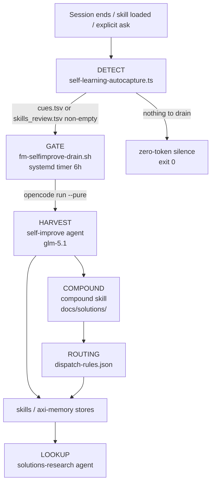
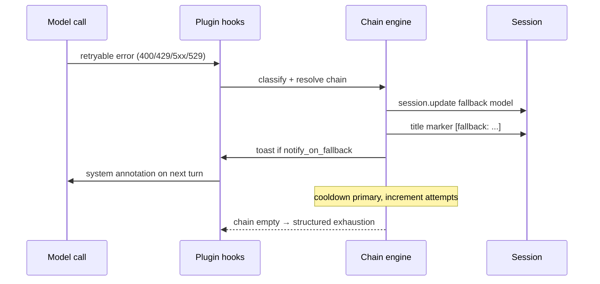
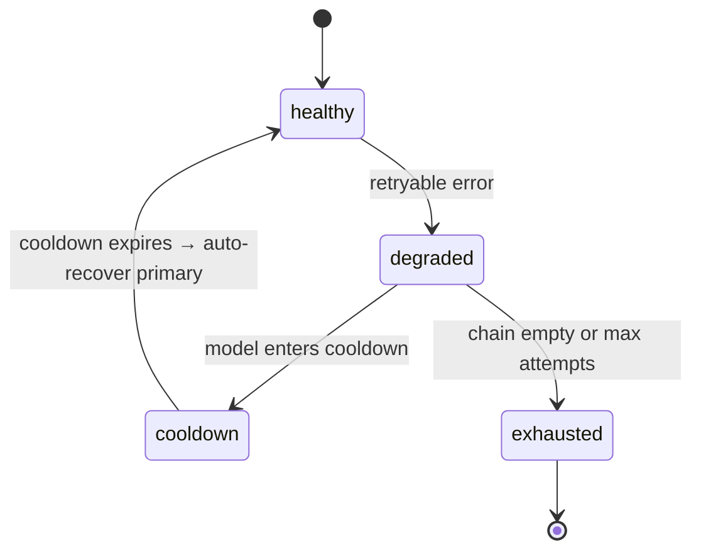
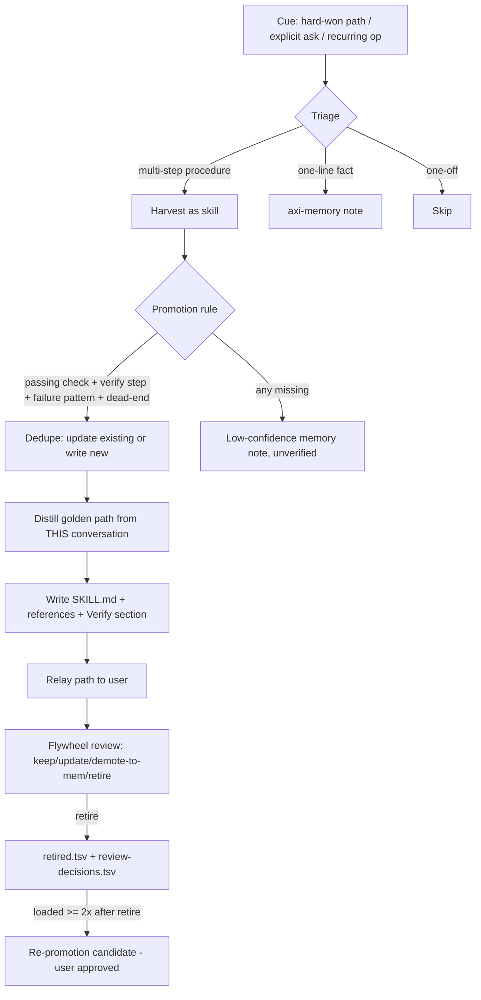

# OpenCode Runtime Systems — Design

Design authority for the three custom runtime systems that keep this agent fleet
operating headlessly:

1. **Self-learning flywheel** — the DETECT → GATE → HARVEST → COMPOUND loop that
   turns hard-won sessions into durable skills and memories.
2. **Model fallback + catalog drift** — reactive chain stepping on failure plus
   the proactive catalog-promotion gate that keeps chains healthy.
3. **axi-memory // self-learning routing** — the triage rules that decide whether
   a lesson becomes a skill, a memory, or nothing.

This document lives in `opencode-config/references/` (house pattern from PR #176)
so it sits next to the config reference (`SKILL.md`) and the model snapshot
(`models.snapshot.json`) that the drift system already maintains. It is the
design companion to `~/.config/opencode/self-improvement-loop.md` (the flywheel's
operations doc) — this file is *why*, that file is *how to run it*.

**Provenance.** PR #167 built the self-improve loop (2026-08-05). PRs #171/#172/#173
wired and fixed the cue loop (2026-08-08) — the last of those carries the failure
lesson in §1.3. PR #174 promoted the runtime-fallback + catalog-drift system
(2026-08-08). PRs #175/#177 removed the OmO/TOON experiments and renamed this
skill. The fallback chain configuration was seeded 2026-08-08 from the recovered
`~/.omo/omo.jsonc` (captain decision). **Cross-machine note:** the flywheel's
design lineage may predate this machine's session history — research and earlier
iterations possibly ran on the `primary` / `kalione` hosts; treat any "first
built here" claim as local-evidence-only.

---

## 1. Self-Learning Flywheel

### 1.1 Pipeline overview

Key invariant: everything below the **GATE** is zero-token (regex + file state,
no LLM) until the gate decides a drain run is warranted. `--pure` is critical —
it disables plugins so the drain cannot re-trigger autocapture on its own
session (self-referential cue loop).

### 1.2 Components

| Stage | Component | Zero-token? | Role |
|---|---|---|---|
| DETECT | `plugins/self-learning-autocapture.ts` | ✅ | session.idle regex/TSV detection → `cues.tsv`, `skill_stats.tsv` → `skills_review.tsv`; evidence rows on session-error / model-fallback |
| GATE | `~/.local/bin/fm-selfimprove-drain.sh` | ✅ | silent exit 0 unless queues non-empty; then `opencode run --pure --agent self-improve "Run your full self-improvement drain procedure now." --format json`; log `~/.local/state/opencode-selflearning/selfimprove-drain.log` |
| HARVEST | `~/.config/opencode/agents/self-improve.md` (primary, opencode-zen/glm-5.1) | ❌ | carries the FULL drain procedure in its prompt (headless runs don't load global AGENTS.md): drain cues from opencode.db transcripts, apply promotion rule, route to stores, append `processed.tsv`, truncate `cues.tsv`; review flywheel digest → `review-pending.tsv`; compound solved problems |
| COMPOUND | `~/.agents/skills/compound/` | ❌ | capture (default) + refresh; `mode:headless`; schema validation via `scripts/validate-frontmatter.py` |
| LOOKUP | `~/.config/opencode/agents/solutions-research.md` (subagent, nemotron-3-ultra-free) | ❌ | searches `docs/solutions/` for applicable past learnings |
| ROUTING | `~/.config/opencode/dispatch-rules.json` | ✅ | 3 rules: compound headless / solutions-research / self-improve |

State files live in `~/.local/state/opencode-selflearning/`: `cues.tsv`
(`<ts>\t<kind>\t<sessionID>\t<detail>`, kinds `explicit|hard-win|session`),
`skill_applications.tsv`, `skill_feedback.tsv`, `skill_stats.tsv`,
`skills_review.tsv` (≤8 pre-aggregated lines, **empty when nothing needs
review**), `retired.tsv`, `review-decisions.tsv`, `evidence.tsv`.

Key thresholds: `SESSION_CUE_MIN_TOOL_CALLS=40`, `MIN_FAILS_TO_FLAG=2`,
`STALE_MS=60d` (cold), `COOLDOWN_MS=14d` (re-flag), `REPROMOTE_MIN_LOADS=2`
(retired skill loaded ≥2× → re-promotion candidate).

### 1.3 The design lesson that shaped it

**Failure `f-2026-08-08` — the unwired cue loop.** The autocapture plugin was
designed on the contract that "a global AGENTS.md instruction consumes
`cues.tsv` at session start." On Aug 8 the plugin was live and writing cues —
but no `AGENTS.md` existed anywhere (`~/.config/opencode/AGENTS.md`,
`~/AGENTS.md`, `~/.agents/AGENTS.md`, `~/.claude/CLAUDE.md` — all absent). The
consumption half of the loop was never wired, so cues accumulated unread.

**Fix:** PR #173 (commit `9f8636c`) created the 17-line AGENTS.md flywheel
section and the current consumption rule; the 14-cue backlog was processed into
`processed.tsv` with honest dispositions and `cues.tsv` truncated so the new
instruction started from a clean queue.

**Rule this teaches:** a system with two halves (produce + consume) is not
"done" until both halves are verified end-to-end — the producer can be
perfect and the system still dead. Verification must include the consumer.

### 1.4 Drill-down map

| Topic | Where |
|---|---|
| Drain procedure & session-synthesis methodology (1a) | `self-improve.md` agent prompt |
| Flywheel ops (run it, log, timer) | `~/.config/opencode/self-improvement-loop.md` |
| Harvest promotion rule (check + verify + failure + dead-end) | `self-learning` skill §"Promotion rule" |
| Skill authoring spec | `self-learning/references/skill-authoring.md` |
| Autocapture regexes & thresholds | `plugins/self-learning-autocapture.ts` header |
| Memory routing | this doc §3 |

---

## 2. Model Fallback + Catalog Drift

The fallback system is **two coupled subsystems**: a reactive runtime fallback
(step the chain when a call fails) and a proactive catalog-promotion pipeline
(drift detection → PR → captain merge) that keeps the chain configuration
current.

### 2.1 Architecture

### 2.2 Failure sequence

### 2.3 Chain state machine

### 2.4 Chain resolution & config

**Resolution order** (per `opencode-fallback.jsonc` header):
1. UI-selected session model
2. agent `fallback_models`
3. category `fallback_models`
4. global `fallback_models` ladder
5. opencode system default

**Keys:** `enabled`, `retry_on_errors`
`[400,401,402,403,429,500,502,503,504,529]`, `max_fallback_attempts: 15`,
`cooldown_seconds: 60`, `timeout_seconds: 120`, `notify_on_fallback: true`.
Classification is retryable on status code, `ProviderAuthError`, or the
RETRYABLE_PATTERN regex (`rate\s?limit|quota|insufficient_quota|server_error|overloaded|timed?\s?out|timeout|429|5\d\d|529|pool.*exhaust`).

**Global ladder (8 tiers, cost-ascending):** CF free (small-prompts only) →
together Ternary-Bonsai (single-shot only) → nvidia NIM (~40 RPM shared, max
1-2 per chain) → openrouter free → opencode-zen free → baseten subsidized →
opencode-go ($10/mo pool) → google/gemini-2.5-flash (paid last resort). KTD6
constraints: GPT-class models only via `opencode/` prefix; Ternary Bonsai never
primary; 400 stays in `retry_on_errors`.

**Per-entry settings** (`temperature`/`maxOutputTokens`/`options`) are promoted
**only when that entry is active** — from the agent or category fallback entry —
and cleared on `session.deleted`. The primary model auto-recovers when its
cooldown expires (`primaryAvailable` → reset, attempts=0). State persists in
`~/.local/state/opencode-fleet/fallback.json`.

**Agent-aware surfaces:** `fallback-status` tool (TOON; healthy chains → the
definitive empty state "chain: healthy"); one-line system-transform annotation
`[model: active on X; N left in fallback chain]`; `tui.prompt.append` is
unavailable in this API version so the annotation rides system-transform.

### 2.5 Catalog drift + promotion gate

- **`catalog-drift.mjs`** fetches models.dev + opencode-zen catalogs, builds a
  snapshot (config-referenced OR free models only) against
  `models.snapshot.json`, diffs on added/removed/price (≥25% blended
  tokens-per-dollar, two-sided) / context-window change, and writes
  `catalog-drift.{json,txt}`. Exit 1 on drift, 2 on failure; `--seed` (re)writes
  the snapshot. Runs via `catalog-drift.service/timer`
  (OnBootSec=10min + daily).
- **`fm-drift-pr.sh`** is the promotion gate's final step: chezmoi re-adds the
  drift-affected files (fallback config, snapshot, SKILL.md), branches
  `fm/catalog-drift-<ts>` from dotfiles master, pushes, and opens a PR with the
  gate criteria body. **Merge = captain approval** — the drift system NEVER
  writes master directly (captain decision 2026-08-08). Identity:
  `${OPENCODE_MODEL:-firstmate}@$(hostname -s)` (deliberate, not the opencode.db
  chain).

### 2.6 Go pool guard

`go-pool-guard.ts` polls `https://opencode.ai/zen/go/v1/usage`; at ≥95% rolling
usage it rewrites every `opencode-go/*` reference in `cfg.agents` /
`cfg.categories` to free alternatives (recursive `replaceWithFree`). It is a
**complementary** proactive guard: the fallback plugin reacts per-call, the pool
guard rewrites the config pre-session when the shared pool is exhausted.

### 2.7 Drill-down map

| Topic | Where |
|---|---|
| Full provider/limits reference (15 providers) | `SKILL.md` (Provider Rate Limits section) |
| Concurrency profiles (team + free) | `SKILL.md` |
| Fallback config (chains, agents, categories) | `opencode-fallback.jsonc` |
| Chain engine (pure functions, unit-tested) | `lib/opencode-runtime-fallback-core.ts` |
| Plugin wiring & state file | `plugins/opencode-runtime-fallback.ts` |
| Drift + promotion scripts | `scripts/catalog-drift.mjs`, `scripts/fm-drift-pr.sh` |
| Prior art consciously NOT adopted | `SKILL.md` (Layer D: Hermes `model_switch`, deepagents `switch_model`) |

---

## 3. axi-memory // Self-Learning Routing

### 3.1 Triage

### 3.2 Store & sync

- **Skills:** `~/.agents/skills/<name>/SKILL.md` (+ `references/`, `assets/`).
  Keep SKILL.md < 500 lines; push detail to references.
- **Memory:** `mem` CLI (`~/.local/bin/mem`), store `~/memories/` (markdown +
  YAML frontmatter git repo, `objects/<type>/`); types
  `constraint|decision|failure|howto|preference`.
- **`mem sync` anchor rule:** on primary/OCI-anchor the remote MUST be the local
  bare `/home/ubuntu/mem-bare.git` — never the tunnel
  `ssh://primary55522.phillias.cc/~/mem-bare.git` (hairpin timeout). Other
  machines use the tunnel URL + `primary55522` alias. Bare repo covered by
  restic.

### 3.3 Gotchas

- **Secrets never in skill files** — record *where* they live (env var, MCP
  tool, vault), never the value.
- **Chezmoi MM divergence:** dispatch-rules edits land in the live target;
  `chezmoi apply` reverts them unless the source is synced.
- **New skills invisible until a fresh session** (`available_skills` is built at
  session start).
- **Headless drains never demote/delete skills** without captain approval
  (reversibility: retire → `_review/` or low-confidence memory, never delete).
- **Identity:** `opencode debug config` returns the DEFAULT model, not the
  session model — use the opencode.db chain for commit authorship.

---

## 4. Maintenance & Evolution

**systemd units (user):** `catalog-drift.{service,timer}` (drift detection),
`selfimprove-drain.{service,timer}` (cue drain, 6h). Neither currently writes a
design doc — if a future `opencode-design` unit is added, its contract is to
regenerate *this* file (or the skill's docs) from the live config, never to
invent structure.

**Design rules for changes:**
- Keep AXI discipline: TOON output, definitive empty states ("chain: healthy"),
  structured errors, no interactive prompts.
- Keep `%h` / `$HOME` portability — no hardcoded home paths (parity rule).
- Chain edits flow through the drift PR gate, never direct master writes.
- When the flywheel procedure changes, regenerate or prune the drill-down maps
  — a stale map is worse than none.
