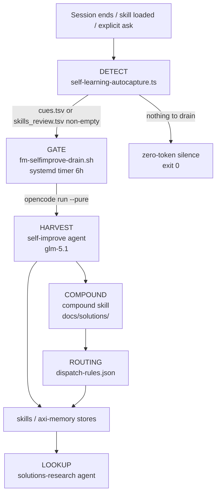
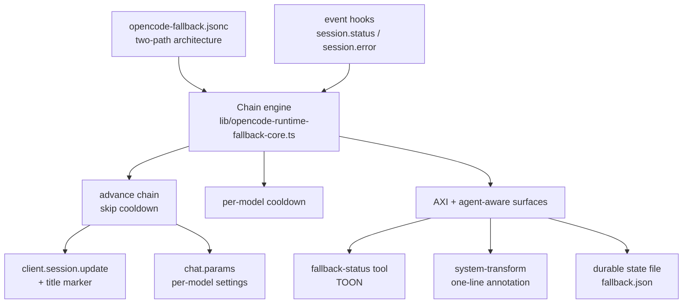
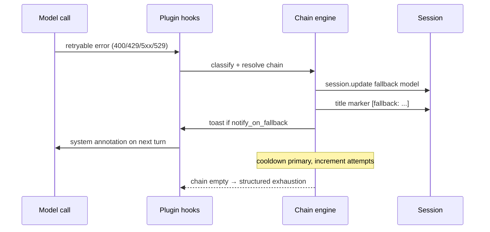
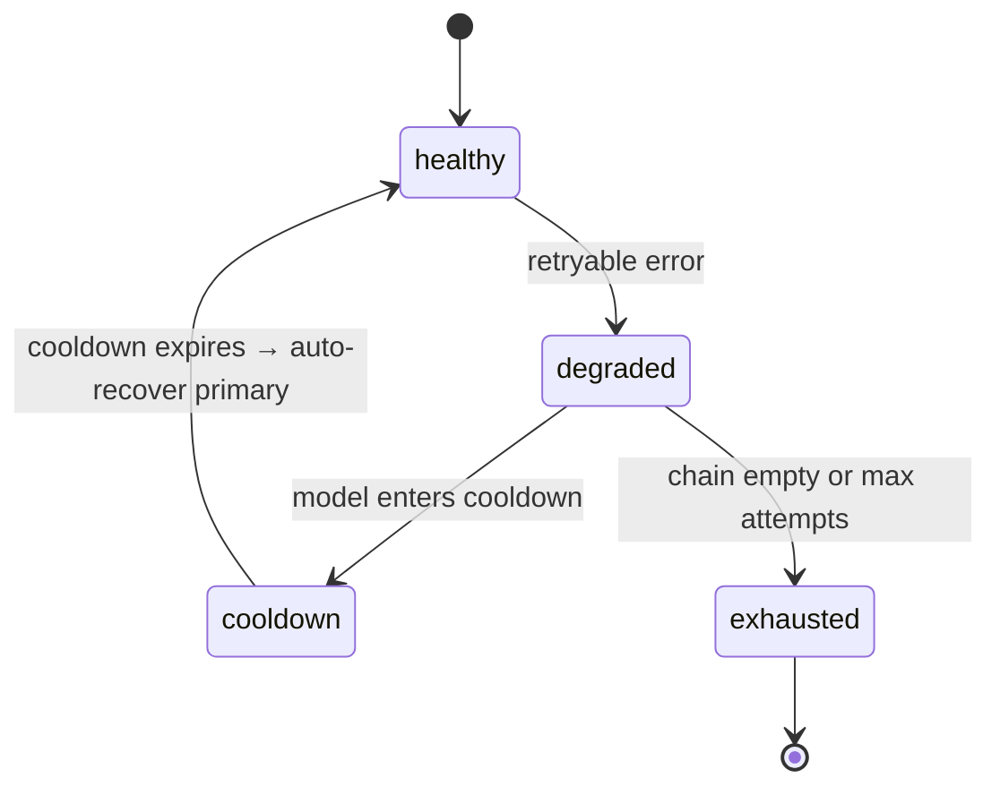
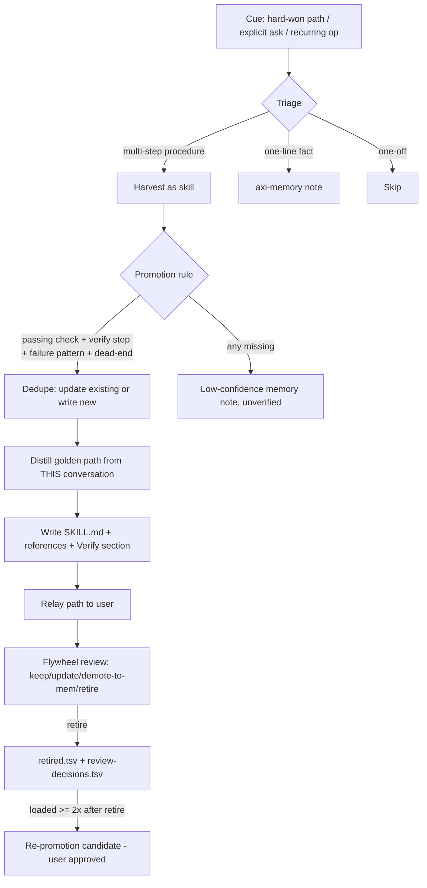
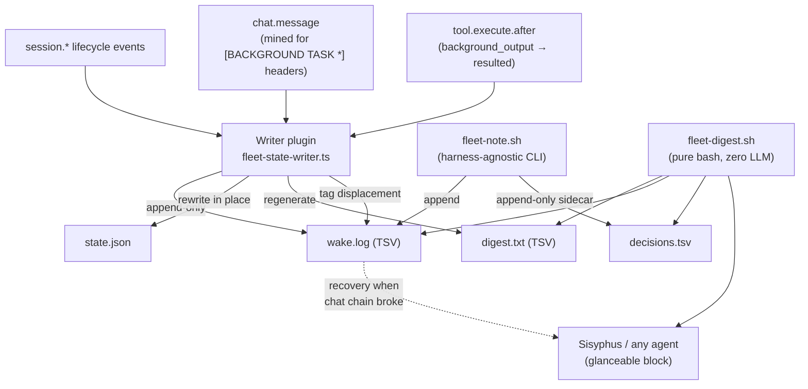

# OpenCode Runtime Systems — Design

Design authority for the four custom runtime systems that keep this agent fleet
operating headlessly:

1. **Self-learning flywheel** — the DETECT → GATE → HARVEST → COMPOUND loop that
   turns hard-won sessions into durable skills and memories.
2. **Model fallback + catalog drift** — reactive chain stepping on failure plus
   the proactive catalog-promotion gate that keeps chains healthy.
3. **axi-memory // self-learning routing** — the triage rules that decide whether
   a lesson becomes a skill, a memory, or nothing.
4. **Fleet state communications** — the zero-token sidecar that recovers
   dispatched-task status and authored decisions when the chat-message hook
   chain is disrupted.

This document lives in `opencode-config/references/` (house pattern from PR #176)
so it sits next to the config reference (`SKILL.md`); the model snapshot
(`models.snapshot.json`) moved to `~/.agents/skills/provider-catalog/`
(2026-09-01). It is the
design companion to `~/.config/opencode/self-improvement-loop.md` (the flywheel's
operations doc) — this file is *why*, that file is *how to run it*.

**Provenance.** PR #167 built the self-improve loop (2026-08-05). PRs #171/#172/#173
wired and fixed the cue loop (2026-08-08) — the last of those carries the failure
lesson in §1.3. PR #174 promoted the runtime-fallback + catalog-drift system
(2026-08-08). PRs #175/#177 removed the OmO/TOON experiments and renamed this
skill. The fallback chain configuration was seeded 2026-08-08 from the recovered
`~/.omo/omo.jsonc` (captain decision). **Cross-machine note:** the flywheel's
design lineage may predate this machine's session history — research and earlier
iterations possibly ran on the `primary` / `kalione` hosts; treat any "first
built here" claim as local-evidence-only.

---

## 1. Self-Learning Flywheel

### 1.1 Pipeline overview



Key invariant: everything below the **GATE** is zero-token (regex + file state,
no LLM) until the gate decides a drain run is warranted. `--pure` is critical —
it disables plugins so the drain cannot re-trigger autocapture on its own
session (self-referential cue loop).

### 1.2 Components

| Stage | Component | Zero-token? | Role |
|---|---|---|---|
| DETECT | `plugins/self-learning-autocapture.ts` | ✅ | session.idle regex/TSV detection → `cues.tsv`, `skill_stats.tsv` → `skills_review.tsv`; evidence rows on session-error / model-fallback |
| GATE | `~/.local/bin/fm-selfimprove-drain.sh` | ✅ | silent exit 0 unless queues non-empty; then `opencode run --pure --agent self-improve "Run your full self-improvement drain procedure now." --format json`; log `~/.local/state/opencode-selflearning/selfimprove-drain.log` |
| HARVEST | `~/.config/opencode/agents/self-improve.md` (primary, opencode-zen/glm-5.1) | ❌ | carries the FULL drain procedure in its prompt (headless runs don't load global AGENTS.md): drain cues from opencode.db transcripts, apply promotion rule, route to stores, append `processed.tsv`, truncate `cues.tsv`; review flywheel digest → `review-pending.tsv`; compound solved problems |
| COMPOUND | `~/.agents/skills/compound/` | ❌ | capture (default) + refresh; `mode:headless`; schema validation via `scripts/validate-frontmatter.py` |
| LOOKUP | `~/.config/opencode/agents/solutions-research.md` (subagent, nemotron-3-ultra-free) | ❌ | searches `docs/solutions/` for applicable past learnings |
| ROUTING | `~/.config/opencode/dispatch-rules.json` | ✅ | 3 rules: compound headless / solutions-research / self-improve |

State files live in `~/.local/state/opencode-selflearning/`: `cues.tsv`
(`<ts>\t<kind>\t<sessionID>\t<detail>`, kinds `explicit|hard-win|session`),
`skill_applications.tsv`, `skill_feedback.tsv`, `skill_stats.tsv`,
`skills_review.tsv` (≤8 pre-aggregated lines, **empty when nothing needs
review**), `retired.tsv`, `review-decisions.tsv`, `evidence.tsv`.

Key thresholds: `SESSION_CUE_MIN_TOOL_CALLS=40`, `MIN_FAILS_TO_FLAG=2`,
`STALE_MS=60d` (cold), `COOLDOWN_MS=14d` (re-flag), `REPROMOTE_MIN_LOADS=2`
(retired skill loaded ≥2× → re-promotion candidate).

### 1.3 The design lesson that shaped it

**Failure `f-2026-08-08` — the unwired cue loop.** The autocapture plugin was
designed on the contract that "a global AGENTS.md instruction consumes
`cues.tsv` at session start." On Aug 8 the plugin was live and writing cues —
but no `AGENTS.md` existed anywhere (`~/.config/opencode/AGENTS.md`,
`~/AGENTS.md`, `~/.agents/AGENTS.md`, `~/.claude/CLAUDE.md` — all absent). The
consumption half of the loop was never wired, so cues accumulated unread.

**Fix:** PR #173 (commit `9f8636c`) created the 17-line AGENTS.md flywheel
section and the current consumption rule; the 14-cue backlog was processed into
`processed.tsv` with honest dispositions and `cues.tsv` truncated so the new
instruction started from a clean queue.

**Rule this teaches:** a system with two halves (produce + consume) is not
"done" until both halves are verified end-to-end — the producer can be
perfect and the system still dead. Verification must include the consumer.

### 1.4 Drill-down map

| Topic | Where |
|---|---|
| Drain procedure & session-synthesis methodology (1a) | `self-improve.md` agent prompt |
| Flywheel ops (run it, log, timer) | `~/.config/opencode/self-improvement-loop.md` |
| Harvest promotion rule (check + verify + failure + dead-end) | `self-learning` skill §"Promotion rule" |
| Skill authoring spec | `self-learning/references/skill-authoring.md` |
| Autocapture regexes & thresholds | `plugins/self-learning-autocapture.ts` header |
| Memory routing | this doc §3 |

---

## 2. Model Fallback + Catalog Drift

The fallback system is **two coupled subsystems**: a reactive runtime fallback
(step the chain when a call fails) and a proactive catalog-promotion pipeline
(drift detection → PR → captain merge) that keeps the chain configuration
current.

### 2.1 Architecture



### 2.2 Failure sequence



### 2.3 Chain state machine



### 2.4 Chain resolution & config

**Resolution order** (per `opencode-fallback.jsonc` header):
1. UI-selected session model
2. agent `fallback_models`
3. category `fallback_models`
4. global `fallback_models` ladder
5. opencode system default

**Keys:** `enabled`, `retry_on_errors`
`[400,401,402,403,429,500,502,503,504,529]`, `max_fallback_attempts: 15`,
`cooldown_seconds: 60`, `timeout_seconds: 120`, `notify_on_fallback: true`.
Classification is retryable on status code, `ProviderAuthError`, or the
RETRYABLE_PATTERN regex (`rate\s?limit|quota|insufficient_quota|server_error|overloaded|timed?\s?out|timeout|429|5\d\d|529|pool.*exhaust`).

**Global ladder:** **two-path since 2026-09-19** — CfAiGw/dynamic/TUI (GLM cascade) → vercel/vmc/tui (Vercel AI Gateway, 376 models, BYOK + system creds) → opencode-go/glm-5.1 → opencode-go/deepseek-v4-flash (session-gated subsidized tail). The gateway route owns intra-GLM failover; the fallback config owns the gateway-vs-direct-client hop. Vercel added 2026-09-20 (captain decision, PR #340): CF credits exhausted; Vercel provides zero-markup fallback. KTD6 constraints: GPT-class models only via `opencode/` prefix; Ternary Bonsai never primary; 400 stays in `retry_on_errors`. Full policy and rationale in §2.6.

**Per-entry settings** (`temperature`/`maxOutputTokens`/`options`) are promoted
**only when that entry is active** — from the agent or category fallback entry —
and cleared on `session.deleted`. The primary model auto-recovers when its
cooldown expires (`primaryAvailable` → reset, attempts=0). State persists in
`~/.local/state/opencode-fleet/fallback.json`.

**Agent-aware surfaces:** `fallback-status` tool (TOON; healthy chains → the
definitive empty state "chain: healthy"); one-line system-transform annotation
`[model: active on X; N left in fallback chain]`; `tui.prompt.append` is
unavailable in this API version so the annotation rides system-transform.

### 2.5 Catalog drift + promotion gate

- **`catalog-drift.mjs`** fetches models.dev + opencode-zen catalogs, builds a
  snapshot (config-referenced OR free models only) against
  `~/.agents/skills/provider-catalog/models.snapshot.json`, diffs on added/removed/price (≥25% blended
  tokens-per-dollar, two-sided) / context-window change, and writes
  `catalog-drift.{json,txt}`. Exit 1 on drift, 2 on failure; `--seed` (re)writes
  the snapshot. Runs via `catalog-drift.service/timer`
  (OnBootSec=10min + daily).
- **`fm-drift-pr.sh`** is the promotion gate's final step: chezmoi re-adds the
  drift-affected files (fallback config, snapshot, SKILL.md), branches
  `fm/catalog-drift-<ts>` from dotfiles master, pushes, and opens a PR with the
  gate criteria body. **Merge = captain approval** — the drift system NEVER
  writes master directly (captain decision 2026-08-08). Identity:
  `${OPENCODE_MODEL:-firstmate}@$(hostname -s)` (deliberate, not the opencode.db
  chain).

### 2.6 Two-path fallback architecture (CF → Vercel → opencode-go)

**2026-09-19 (captain decision):** the fallback architecture is now a **two-path system**:

- **Path 1 — CF AI Gateway dynamic routes**: `CfAiGw/dynamic/TUI` (and `pr-gate`, `high`, etc.) handle their own internal GLM cascades (free → subsidized → PAYG). The gateway route owns intra-GLM failover; the fallback config owns the gateway-vs-direct-client hop.
- **Path 2 — Runtime fallback chains**: `CfAiGw/dynamic/TUI` first → `vercel/vmc/tui` → `opencode-go/glm-5.1` → `opencode-go/deepseek-v4-flash`. Vercel is the CF-gateway-outage fallback; opencode-go is the session-gated subsidized pool tail.

opencode-go can never be a gateway route node (it requires the `x-opencode-session` header that only the Go client provides).

**Automatic failover (CF → Vercel → opencode-go):**
- **OpenCode** (`opencode-fallback.jsonc`): global/agent/category ladders insert `vercel/vmc/tui` as stage 1. Provider-qualified IDs (`CfAiGw/dynamic/TUI`, `vercel/vmc/tui`) so the fallback plugin swaps correctly on retryable session errors.
- **Pi** (`~/.pi/fallback-chains.json`): `fallback/gate` and `fallback/default` chains insert Vercel vmc models as the second rung.
- **No-mistakes** (`config.yaml`): `agent_config.pi.model` and `review_agents.reviewer.model` ride `fallback/gate` instead of directly pinning `CfAiGw/dynamic/pr-gate`, so automated validation also falls through to Vercel.

**Manual profile switching (no automatic failover — tool limitation):**
- **Codex**: `vercel-aig` provider in `config.toml.tmpl`, Vercel profile in separate `vercel.config.toml.tmpl` (Codex 0.153.4+ deprecated `[profiles.*]` in config.toml). Switch with `codex --profile vercel`. No ordered retry/failover configuration.
- **Kimi Code**: `vercel-aig` provider and `tui-via-vercel` model registered. Single `default_model` / `-m` selection only; no ordered fallback chain. Switch manually or via `-m tui-via-vercel`.
- **opencode-go**: Cannot ride Vercel (no opencode.ai provider). Stays CF-only.

**Not included (by design):**
- **Muse**: rides Meta's Model API directly, not through any gateway.
- **Cursor**: needs a dedicated reverse-proxy surface, lower priority.

**Historical evolution** (decision trail):

| Date | Change |
|---|---|
| 2026-08-12 | Paid-first: GOAT → Go → Cloudflare → Zen |
| 2026-08-16 | CF AI Gateway inserted between Go and Zen: GOAT → Go → **CF** → Zen |
| 2026-08-25 | Z.AI Lite $18/mo inserted between GOAT and CF; OpenRouter added after CF |
| 2026-08-29 | Six providers routed through CF AI Gateway `opencode` via BYOK; `/compat` deprecated |
| 2026-09-20 | Vercel AI Gateway added as fallback tier (376 models, 47 providers, $0 markup); dedicated harness surfaces; no-mistakes gates routed through fallback chains |
| 2026-09-21 | Worker fixes: Codex profile modernized to `vercel.config.toml.tmpl`; no-mistakes gates wired through `fallback/gate`; opencode runtime fallback wired; key path portability fix |

**Fleet integration** (the `agents`/`categories`/global blocks map to the live fleet):

- **Firstmate session** — no agent name, resolves to the **global `fallback_models` ladder**: CfAiGw/dynamic/TUI → vercel/vmc/tui → opencode-go/glm-5.1 → opencode-go/deepseek-v4-flash.
- **Crewmates** (`task(subagent_type=...)`) — utility types (`general`, `explore`): CfAiGw/dynamic/TUI primary, fallback vercel/vmc/tui → opencode-go tail. Specialized types stay pinned with fallback Z.AI → GOAT → Go → Zen only (no free downgrade; failure surfaces visibly).
- **Categories** (`task(category=...)`) — utility categories (`quick`, `unspecified-low`): CfAiGw/dynamic/TUI + Vercel → opencode-go tail. High-intensity/specialized categories stay pinned with fallback Z.AI → GOAT → Go → Zen only.
- **Secondmates** — same chezmoi-synced config; their main sessions resolve the global ladder.

The LLM determines a subagent's model by choosing the task shape at the intent
gate (dispatch-rules.json → `task(category=...)` / `task(subagent_type=...)`);
`chat.params.agent` → `resolveChain` → agent > category > global ladder. This is
the "know, not operate" contract — the LLM picks the class of work, never the
specific model (Layer D stays deferred). Spawn-time cheapest-qualified-lane
selection moved to the provider-catalog skill (2026-09-01): see
`~/.agents/skills/provider-catalog/references/PROVIDERS.md`.

### 2.7 Drill-down map

| Topic | Where |
|---|---|
| Full provider/limits reference (16 providers) | `SKILL.md` (Provider Rate Limits section) |
| Concurrency profiles (team + free) | `SKILL.md` |
| Fallback config (chains, agents, categories) | `opencode-fallback.jsonc` |
| Chain engine (pure functions, unit-tested) | `lib/opencode-runtime-fallback-core.ts` |
| Plugin wiring & state file | `plugins/opencode-runtime-fallback.ts` |
| Drift + promotion scripts | `scripts/catalog-drift.mjs`, `scripts/fm-drift-pr.sh` |
| Prior art consciously NOT adopted | `SKILL.md` (Layer D: Hermes `model_switch`, deepagents `switch_model`) |

---

## 3. axi-memory // Self-Learning Routing

### 3.1 Triage



### 3.2 Store & sync

- **Skills:** `~/.agents/skills/<name>/SKILL.md` (+ `references/`, `assets/`).
  Keep SKILL.md < 500 lines; push detail to references.
- **Memory:** `mem` CLI (`~/.local/bin/mem`), store `~/memories/` (markdown +
  YAML frontmatter git repo, `objects/<type>/`); types
  `constraint|decision|failure|howto|preference`.
- **L0 abstracts:** optional `abstract: "<≤120 chars>"` frontmatter field on
  memory files. Used by `mem search --inject` for compact recall output
  (`id type title — abstract` per line, ≤120 chars each). When absent, falls
  back to first 120 chars of body. Agent-authored memories should always
  include an abstract via the `axi-memory-add` tool's `abstract` parameter;
  auto-captured memories extract it from the captured text.
- **`mem sync` anchor rule:** on primary/OCI-anchor the remote MUST be the local
  bare `/home/ubuntu/mem-bare.git` — never the tunnel
  `ssh://primary55522.phillias.cc/~/mem-bare.git` (hairpin timeout). Other
  machines use the tunnel URL + `primary55522` alias. Bare repo covered by
  restic.

### 3.3 Gotchas

- **Secrets never in skill files** — record *where* they live (env var, MCP
  tool, vault), never the value.
- **Chezmoi MM divergence:** dispatch-rules edits land in the live target;
  `chezmoi apply` reverts them unless the source is synced.
- **New skills invisible until a fresh session** (`available_skills` is built at
  session start).
- **Headless drains never demote/delete skills** without captain approval
  (reversibility: retire → `_review/` or low-confidence memory, never delete).
- **Identity:** `opencode debug config` returns the DEFAULT model, not the
  session model — use the opencode.db chain for commit authorship.

---

## 4. Fleet State Communications (Zero-Token Background-Task Status)

Background-task completion notifications delivered via
`<system-reminder>[BACKGROUND TASK COMPLETED]...</system-reminder>` are fragile:
they ride the `chat.message` hook chain, which can be disrupted by compaction
(`experimental.session.compacting`), model fallback, or other plugins
intercepting the chain mid-turn. To recover dispatched-task status regardless of
chat-message delivery, a **sidecar state tree** is maintained on disk — a terse
index, never the transcript source of truth (that lives in `opencode.db`).

### 4.1 Architecture



Key invariant: every write path is **non-LLM** (TypeScript plugin handlers + a
bash CLI), and the readable summary is pure bash. A decision record is a direct
filesystem write — it rides no hook chain, so it survives exactly the fragility
the sidecar exists to defeat.

### 4.2 State tree

`~/.local/state/opencode-fleet/`

| File | Format | Owner | Purpose |
|---|---|---|---|
| `wake.log` | TSV append-only: `<ISO>\t<type>\t<session_id>\t<digest>` | writer plugin + `fleet-note.sh` | Raw event log. Rotates >1MB to last 1000 lines. Types: `session.*`, `chat.message.bg`, `tool.background_output`, `fleet.gc`, `fleet.decision`, `fleet.replaced`. |
| `state.json` | JSON snapshot, rewritten in place | **writer plugin only** | Current state of every dispatched task; `tasks` map keyed by session_id/task_id. Terminal states (`completed`/`failed`/`cancelled`) are never overwritten. |
| `digest.txt` | TSV: `<key>\t<status>\t<type>\t<digest>\t<age> ago` | writer plugin | Regenerated whenever `state.json` changes. |
| `decisions.tsv` | TSV append-only: `<key>\t<ISO>\t<type>\t<decision>\t<rationale>` | **`fleet-note.sh` only** | Sidecar of authored decisions. Never written by the plugin → cannot race `state.json` rewrites. Surfaced by `fleet-digest.sh`. |

Single-writer discipline: `state.json` is the plugin's whole-file rewrite;
`decisions.tsv` is `fleet-note.sh`'s append. Two writers, two files, no races.

### 4.3 Writer plugin (`plugins/fleet-state-writer.ts`)

Subscribes to `event` (all `session.*`), `chat.message` (mines
`[BACKGROUND TASK RESULT READY|COMPLETED|CANCELLED|INTERRUPTED|ERROR]` headers),
and `tool.execute.after` (marks `bg_...` tasks `resulted` when their output is
fetched). Never throws — every handler catches + logs.

Two transition protections in `updateTask`:

- **Terminal guard:** never overwrite `completed`/`failed`/`cancelled`.
- **`fleet.replaced` flag:** when a record's `digest` is overwritten with a
  different reason, append `fleet.replaced` (`prev=<old> -> <new>`) so no
  transition is silently swallowed — the displaced reason stays recoverable by
  name alongside the append-only `wake.log`.

### 4.4 Decision authoring (`scripts/fleet-note.sh`)

Fail-closed, harness-agnostic CLI:

```bash
scripts/fleet-note.sh <key> --decision "<text>" [--rationale "<text>"] [--type dispatch|merge|teardown|other]
```

Records a decision at two points (any orchestrating agent — Sisyphus, firstmate,
or another harness — calls the same CLI):

- **At dispatch:** `--type dispatch --decision "<why this task is running>"`
- **At terminal outcome:** `--type merge|teardown --decision "<merged / PR opened / discarded>"`

Survives chat-chain fragility by design (direct filesystem write, no hook
delivery). `fleet-digest.sh` surfaces the latest decision per key in its
`== decisions ==` section.

### 4.5 Reader (`scripts/fleet-digest.sh`)

Pure bash, zero LLM. Emits a single glanceable block:

```bash
scripts/fleet-digest.sh              # state + decisions + wakes from last 30m
scripts/fleet-digest.sh --since 60   # last 60m of wakes
scripts/fleet-digest.sh --wakes-only # just recent wake events
scripts/fleet-digest.sh --json       # raw state.json
```

### 4.6 When to consult

- **At session start** — `bash scripts/fleet-digest.sh` to ground yourself
- **After a background-task system-reminder** — verify against `state.json`
- **Before dispatching** — glance at `digest.txt` to avoid duplicate dispatches
- **When the user asks "what's running?"** — `fleet-digest.sh --since 240`

### 4.7 Failure modes

- `state.json` empty/missing → sidecar not loaded; fall back to
  `background_output` API.
- `wake.log` corrupted → truncate and let the plugin repopulate.
- The state tree is **never** the transcript source of truth (`opencode.db`
  `session`/`message`/`part` tables are). It is a **terse index** for fast
  reads.

### 4.8 Drill-down map

| Topic | Where |
|---|---|
| Writer plugin wiring & wake types | `plugins/fleet-state-writer.ts` |
| Reader output format & flags | `scripts/fleet-digest.sh` |
| Decision authoring contract | `scripts/fleet-note.sh`, `~/.config/opencode/AGENTS.md` §"Fleet State Communications" |
| Decision consumption in agent turns | global `AGENTS.md` fleet-state section |

---

## 5. Hook Collision Risk Assessment (firstmate on opencode)

Collision analysis performed 2026-08-15 for a firstmate deployment running
exclusively on the opencode harness. Verdict: runtime-fallback, the axi-memory
flywheel (bridge + autocapture), and fleet-state-writer each provide more value
than risk; net collision risk is low and was priced in at design time. The
sections below record the risk paths and their mitigations.

### 5.1 Hook surface map

| Plugin | Hooks | Overlap with firstmate |
|---|---|---|
| runtime-fallback | `event` (session.status retry / session.error / session.deleted), `chat.params`, `experimental.chat.system.transform`, `tool.fallback-status` | No `chat.message`; no shared `event` types; `chat.params` is fallback-only |
| axi-memory-bridge | `chat.message` (try/catch-wrapped), `experimental.chat.system.transform`, `tool.execute.after` | Pushes alongside on `system.transform` — additive, compatible |
| self-learning-autocapture | `chat.message`, `tool.execute.after`, `event` (session.idle) | Shares `event` session.idle with firstmate's turn-end guard and watch-arm; all three coexist |
| fleet-state-writer | `event` (all session.*), `chat.message` (mined), `tool.execute.after` | Firstmate consumes its sidecar output; handlers never throw |
| firstmate (project-local) | `event` (session.created/idle), `tool.execute.before` | Disjoint from fallback surfaces by construction |

### 5.2 Risk path 1 — `chat.params` auto-recovery overrides dispatched models

The fallback's `chat.params` handler reverts any session whose active model sits
at chain index > 0 back to the chain primary (`big-pickle`) as soon as the
primary is healthy — on the first turn if it is not cooling. It cannot
distinguish "fell back on a runtime error" from "explicitly dispatched to a
mid-chain model." Under an opencode-exclusive firstmate every crewmate is an
opencode-harness spawn, so this fires **per dispatch** whenever crew-dispatch
resolves a mid-chain model for opencode work. It is a behavioral override, not
a crash.

**Tuning rule:** resolve crew-dispatch profiles for opencode-harness spawns only
to the chain-top model (`big-pickle`) or a non-chain model, so auto-recovery
never fires and dispatched model choices stick. No `no-auto-recover` flag exists
in the fallback config today — one would require a plugin change.

### 5.3 Risk path 2 — mid-turn stepping vs the `chat.message` chain

Already documented in §4: mid-turn model fallback can disrupt the `chat.message`
hook chain, and fleet-state-writer's disk sidecar exists to survive exactly that.
Consequence for the flywheel: a mid-turn step could swallow a harvest cue or
memory-score event in autocapture / axi-memory-bridge. Recoverable — cues
re-derive from session transcripts — and the price of keeping the session alive.

### 5.4 Non-risks (additive or disjoint surfaces)

- `experimental.chat.system.transform` — the fallback annotation and memory
  injection both push to `output.system`; no overwrite.
- `event` types — fallback consumes session.status/error/deleted; firstmate
  consumes session.created/idle. Disjoint.
- `chat.message` consumers — fleet-state-writer, axi-memory-bridge, and
  autocapture are all catch-wrapped; axi-memory-bridge ships an explicit
  "never throw into the chain" contract plus a dedicated test
  (`axi-memory-bridge-chat-guard.test.ts`).
- `tool.execute.before` is firstmate-owned (pretool / cd checks) and shared with
  no runtime plugin.

### 5.5 Drill-down map

| Topic | Where |
|---|---|
| Fallback `chat.params` auto-recovery logic | `plugins/opencode-runtime-fallback.ts` (chat.params handler) |
| `chat.message` chain disruption (design rationale) | this doc §4 |
| Flywheel consumer contract | `plugins/axi-memory-bridge.ts`, `plugins/self-learning-autocapture.ts` |
| Crew-dispatch model resolution | firstmate `config/crew-dispatch.json` + `bin/fm-spawn.sh` |

### 5.6 Plugin Hook Catalog

Complete reference of every plugin and which hooks it subscribes to. Updated
when plugins are added or removed. Every `chat.message` handler MUST wrap in
try/catch and never rethrow — a throw disrupts the entire hook chain for all
subscribers.

#### `chat.message` — called for every user and assistant message

| # | Plugin | Failure Mode | Purpose |
|---|---|---|---|
| 1 | opencode-log-sanitizer | swallow | Redacts JWTs, bcrypt hashes, base64 blobs, long quoted strings |
| 2 | fleet-state-writer | swallow | Mines `[BACKGROUND TASK *]` headers; records task state transitions |
| 3 | axi-memory-bridge | swallow | Injection veto, stores last user message, scores for auto-capture, topic-shift auto-recall |

**Execution order:** opencode runs handlers in plugin registration order
(opencode.json `plugin[]` array). Log-sanitizer runs first so redacted content
never reaches downstream handlers. All three must be isolation-safe.

#### `experimental.chat.system.transform` — inject into system prompt per session

| # | Plugin | Failure Mode | Purpose |
|---|---|---|---|
| 1 | axi-memory-bridge | swallow | One-shot axi-memory search injection (first user message → `mem search --inject` → compact L0 abstracts) |
| 2 | axi-gh-axi.js | swallow | gh-axi ambient context (issues, PRs, help) |
| 3 | axi-chrome-devtools-axi.js | swallow | chrome-devtools-axi ambient context |
| 4 | axi-lavish-axi.js | swallow | lavish-axi ambient context (sessions, visual guidance, playbooks) |
| 5 | opencode-runtime-fallback.ts | swallow | Fallback chain state annotation |

#### `tool.execute.after` — after every tool call

| # | Plugin | Failure Mode | Purpose |
|---|---|---|---|
| 1 | axi-memory-bridge | swallow | Auto-search axi-memory; appends ambient context (throttled 5s/session, LRU cached 60s) |
| 2 | opencode-telemetry | swallow | Records tool call completion, output sizes, timing |

#### `tool.execute.before` — before every tool call

| # | Plugin | Failure Mode | Purpose |
|---|---|---|---|
| 1 | envsitter-guard | block | Blocks `read`/`edit`/`write` on `.env*` files; redirects to EnvSitter |
| 2 | opencode-telemetry | swallow | Records tool call start timestamps |

#### `event` — session lifecycle events

| # | Plugin | Failure Mode | Purpose |
|---|---|---|---|
| 1 | fleet-state-writer | swallow | Task state → `state.json` + `wake.log` |
| 2 | opencode-ntfy.sh | swallow | Push notifications via ntfy.sh |
| 3 | opencode-telemetry | swallow | SQLite telemetry |
| 4 | opencode-runtime-fallback.ts | swallow | Model fallback chain on retry/error |
| 5 | tps-status.tsx | swallow | TPS calculation for TUI status bar |

#### `tool` — register custom tools

| Plugin | Tools |
|---|---|
| envsitter-guard | `envsitter_*` (keys, match, set, add, delete, copy, format, validate, annotate, help) |
| axi-memory-bridge | `axi-memory-search`, `axi-memory-add`, `axi-memory-show` |
| opencode-runtime-fallback.ts | `fallback-status` |

#### Safety contract

1. Every `chat.message` handler wraps in try/catch. Errors logged to
   `console.error` with plugin prefix, swallowed. A throw disrupts all
   downstream subscribers.
2. Every `event` handler is similarly isolated.
3. `tool.execute.before` handlers that block return immediately after blocking.
4. `experimental.chat.system.transform` handlers are additive — each appends
   to `output.system[]`. No handler reads or modifies another's strings.
5. No plugin reads or writes another plugin's in-memory state. Each owns its
   own `Map`/`Set` keyed by `sessionID`.

---

## 6. Maintenance & Evolution

**systemd units (user):** `catalog-drift.{service,timer}` (drift detection),
`selfimprove-drain.{service,timer}` (cue drain, 6h). Neither currently writes a
design doc — if a future `opencode-design` unit is added, its contract is to
regenerate *this* file (or the skill's docs) from the live config, never to
invent structure.

**Design rules for changes:**
- Keep AXI discipline: TOON output, definitive empty states ("chain: healthy"),
  structured errors, no interactive prompts.
- Keep `%h` / `$HOME` portability — no hardcoded home paths (parity rule).
- Chain edits flow through the drift PR gate, never direct master writes.
- When the flywheel procedure changes, regenerate or prune the drill-down maps
  — a stale map is worse than none.

---

## 7. Architecture Overview — Single-Root Config System

The OpenCode config is a single-root layer with no profiles (`OPENCODE_CONFIG_DIR`
unset) and no environment switching. Machine diffs are handled via chezmoi `.tmpl`;
no symlinks. OmO-era material is archived in `ARCHIVE-OMO.md`.

### 7.1 `~/.config/opencode/` tree (live)

- `opencode.json` — root config: providers + MCPs + compaction (20 providers)
- `opencode-fallback.jsonc` — global default fallback (PAID-FIRST chain; project > global first-match-wins)
- `dispatch-rules.json` — 30 crew-dispatch rules
- `plugins/` — fleet-state-writer.ts, self-learning-autocapture.ts, axi-memory-bridge.ts, tps-status.tsx, opencode-runtime-fallback.ts (retired: better-compaction.ts, tmux-subagent-activator.ts, go-pool-guard.ts)
- `lib/` — opencode-runtime-fallback-core.ts
- `scripts/` — fleet-digest.sh, fleet-note.sh, catalog-drift.mjs, fm-drift-pr.sh
- `AGENTS.md`, `docs/plans/`, `skills/`, `.*-key` files

Runtime state: `~/.local/state/opencode-fleet/` (wake.log, state.json, digest.txt, decisions.tsv, fallback.json).

### 7.2 Critical rules

1. One config, no profiles, `OPENCODE_CONFIG_DIR` unset.
2. `opencode.json` defines the live providers + MCPs.
3. Routing is owned by `opencode-fallback.jsonc` (agents/categories/global); the legacy `oh-my-openagent.jsonc` orphan is never read.
4. `opencode-fallback.jsonc` is the global default fallback — project > global first-match-wins.
5. Plugins auto-load from `plugins/`; retired plugins are enforced-removed.
6. No symlinks, no env switching; machine diffs via chezmoi `.tmpl` with `%h` / `$HOME` portability.

### 7.3 Config defaults (live)

`small_model: opencode-zen/nemotron-3-ultra-free` · `compaction {auto:false, prune:true, reserved:50000, tail_turns:40}` · MCP baseline: context7, grep_app, websearch, mcp_everything. TUI theme: tokyonight (tui.json), solarized-dark alternative.

### 7.4 Mermaid hygiene

Node labels containing `<br/>` MUST be quoted (`["text<br/>text"]`). Unquoted `<br/>` inside `[...]` breaks the chart — the root cause of the rendering error at "Layer D → Architecture".


## 8. Provider mechanics (opencode.jsonc-specific)

Shared provider/model facts (stack, gateway routing, BYOK, pricing, quirks,
rate limits) are owned by the `provider-catalog` skill
(`~/.agents/skills/provider-catalog/references/PROVIDERS.md`); see
`references/PROVIDERS.md` (stub). This section covers opencode-config
specifics that describe THIS config's own files and behavior, not provider
facts.

### Provider concurrency (live config)

**Team Profile:** defaultConcurrency 8; providerConcurrency {opencode 15, opencode-zen 15, opencode-go 8, openrouter 6}; modelConcurrency {big-pickle 2, kimi-k2.6 3, ds-v4-pro 2, gpt-5.5 2, gpt-5.4 2, gpt-5.3-codex 2, glm-5.1 2, ds-v4-flash 15, zen/kimi-k2.6 2}.
**Free Profile:** default 5; provider {opencode 10, openrouter 5}; modelConcurrency {}.
