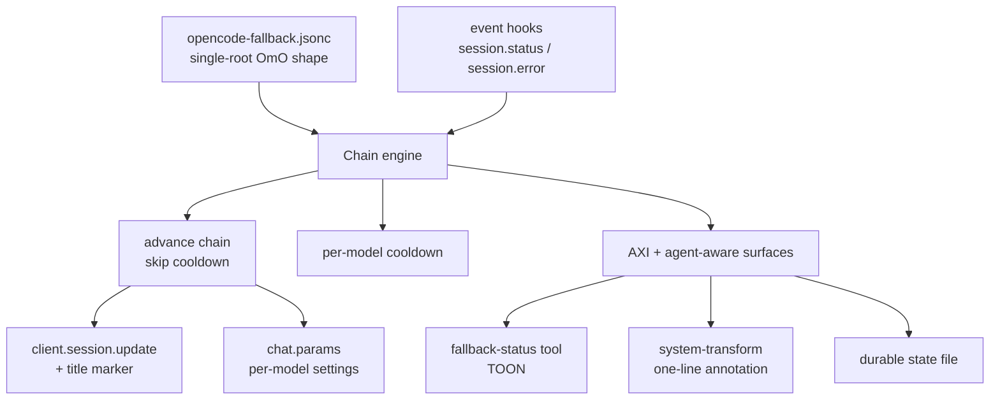
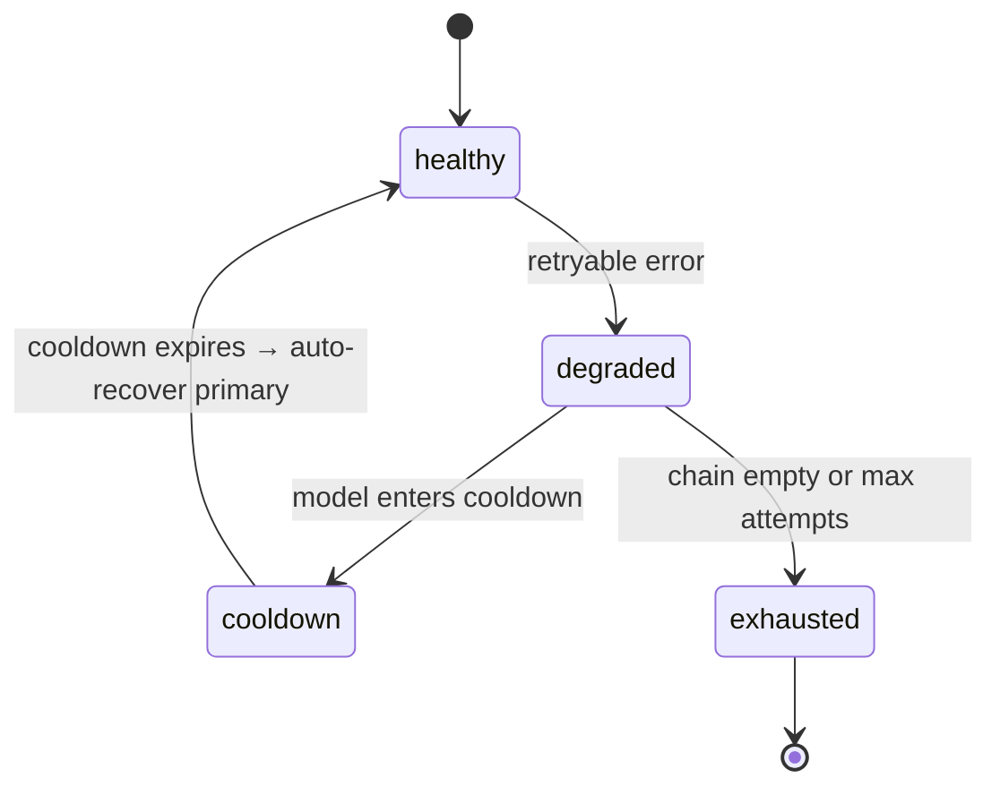

# Plugins

Runtime-behavior plugins loaded by the OpenCode config. All plugin-level — opencode core has zero native fallback/retry keywords (schema audit).

## Auto-loaded plugin stack

- **fleet-state-writer.ts** — event subscription → sidecar state tree (see DESIGN.md §4)
- **axi-memory-bridge.ts** — durable memory bridge
- **self-learning-autocapture.ts** — harvest-cue writer (see DESIGN.md §1)
- **tps-status.tsx** — TUI status widget
- **opencode-runtime-fallback.ts** — model fallback (this file) + `lib/opencode-runtime-fallback-core.ts`
- **opencode-ntfy.sh**, **opencode-log-sanitizer**, **envsitter-guard**, **opencode-telemetry** — notification/observability hooks
- **dcp node_module** — context-management hook

**Retired (enforced-removed):** better-compaction.ts, tmux-subagent-activator.ts (2026), go-pool-guard.ts (2026-08-12).

## Runtime fallback plugin

Local plugin `plugins/opencode-runtime-fallback.ts` + core lib `lib/opencode-runtime-fallback-core.ts` (added 2026-08-08, replaces go-pool-fallback). Config source: `opencode-fallback.jsonc` (global default; project overrides win via first-match-wins).

### Behavior

- **Reactive** runtime-fallback on retryable failure → advance chain + per-model cooldown + title marker `[fallback: X]` + toast.
- **Proactive** model-fallback per-agent/category resolved via `chat.params`; per-entry settings promoted only when the model is active.

### Model resolution order

UI session model → agent (exact then longest `*` wildcard) → category → global ladder → system default.

### Agent-aware surfaces

- `fallback-status` tool (TOON: one line when healthy, structured when degraded)
- system-transform annotation (one-line chain state)
- durable state file `~/.local/state/opencode-fleet/fallback.json` (live; healthy chains emit zero output)

### Chain source & history

Seeded 2026-08-08 from `~/.omo/omo.jsonc` (chezmoi 055dc6b^) + recovered Tier 1/2/3 tables → 14 agents, 8 categories. KTD6 constraints: GPT only via `opencode/` prefix; Bonsai single-shot; ≤1-2 NIM models; 400 in retry. `runtime_fallback max_attempts` raised 1→3.

### Promotion gate

Chain edits flow through `bin/fm-drift-pr.sh`: chezmoi re-add → branch `fm/catalog-drift-<ts>` → PR to dotfiles master (captain approval = merge). Commit identity `${OPENCODE_MODEL:-firstmate}@$(hostname -s)`.

### Layer D (deferred 2026-08-08)

No agent-callable chain-switch tool. AXI token discipline; know-not-operate contract. Deferred per captain decision — revisit only with explicit need.

### Architecture



```mermaid
sequenceDiagram
  participant M as Model call
  participant H as Plugin hooks
  participant E as Chain engine
  participant S as Session
  M->>H: retryable error (400/429/5xx/529)
  H->>E: classify + resolve chain
  E->>S: session.update fallback model
  E->>S: title marker [fallback: ...]
  E->>H: toast if notify_on_fallback
  H->>M: system annotation on next turn
  Note over E: cooldown primary; attempts++
  E-->>H: chain empty → structured exhaustion
```



**Mermaid parsing note:** node labels containing `<br/>` MUST be quoted — `CFG["opencode-fallback.jsonc<br/>single-root OmO shape"]` — unquoted `<br/>` inside `[...]` breaks the chart (the exact error the captain hit at "Layer D → Architecture"). The charts above carry the fix.

## Fleet state writer fixes (2026-07-22)

Root causes of 24 stuck subagent sessions:
1. `session.diff`/`session.updated` overwrote terminal states
2. error serialization produced `[object Object]`
3. no staleness GC
4. `session.status` fallthrough

Fixes applied: terminal-state protection, no-op event mapping, 4h stale GC, `error.message` extraction, HF_API_KEY export. See DESIGN.md §4 for the full state-tree contract.
