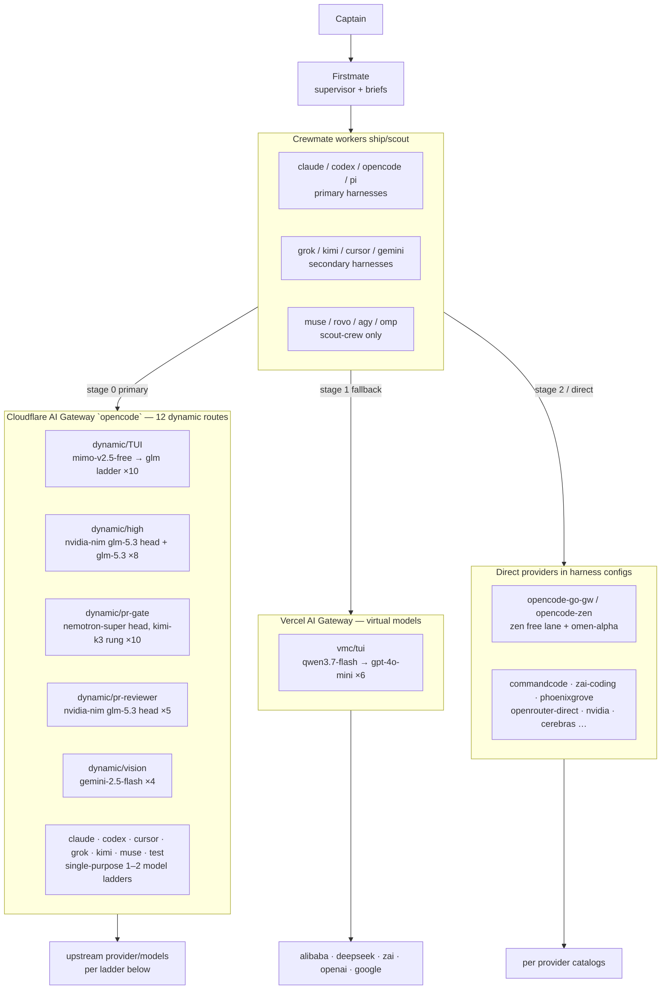
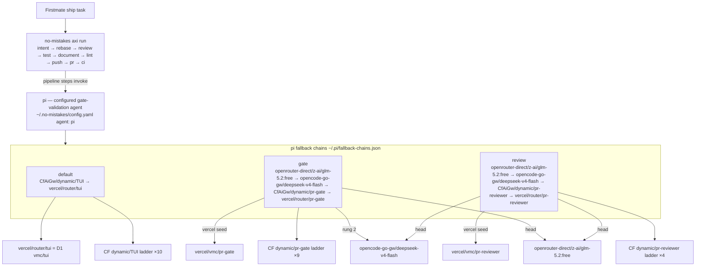

# Routing topology (D1-generated snapshot)

Snapshot generated 2026-09-28 from the shared D1 `provider-catalog` registry: 15 routes, 64 ladder steps, 53 model rows.
Structural update 2026-10-03 (antigravity worker routes, captain-ordered): 17 routes, 70 ladder steps, 55 model rows. D1 rows inserted same day; refresh picks them up automatically.
Structural update 2026-10-04 (no-mistakes gate harden, dotfiles PR #392): longcat rung dropped from the gate chain; head is now opencode-go-gw/deepseek-v4-flash (→ CfAiGw/dynamic/pr-gate → vercel/router/pr-gate). longcat-2.5-preview-free was removed for repeated JSON parse failures and silent stalls — see references/NO_MISTAKES_MODELS.md verdict table.
Structural update 2026-10-04, later same day (captain directive, JSON-chain positioning): openrouter-direct/z-ai/glm-5.2:free moved to the HEAD of both gate and review chains — every JSON-bearing no-mistakes stage (reviewer, test, document, lint, rebase-repair, PR-drafting, CI-fix) tries the free glm lane first; deepseek-v4-flash stays rung-2 as the proven-JSON safety net; virtual routers demoted behind it; the former PAYG z-ai/glm-5.2 terminal rung retired from both chains. Longcat is light-work/scout-class only, never a JSON-bearing pipeline rung.
The underlying tables refresh daily at 05:00 ET via `d1-registry-refresh.mjs`; this document is a manual snapshot — regenerate after structural route changes. Regenerated 2026-09-28 after the NIM free-access fit (pr-reviewer head swap, high NIM head, pr-gate Kimi-K3 rung); D1 rows catch up on the first post-`wrangler login` registry refresh.
Live quota truth is always `quota-axi`, never this file. Ladder truth is the gateway; D1 mirrors it.

## Flow 1 — firstmate → harnesses → (virtual) providers → models

### Cloudflare `dynamic/*` ladders (position order, head first)

| Route | Ladder (provider/model, fallback order) |
|---|---|
| dynamic/TUI | opencode-zen/mimo-v2.5-free → glm-5.1 → glm-5.2 → glm-5.3-flash → commandcode/GLM-5.1 → phoenixgrove/glm-5.2 → commandcode/GLM-5.2 → commandcode/glm-5.3-flash → phoenixgrove/glm-5.3-flash → openrouter/z-ai/glm-5.1 |
| dynamic/high | nvidia-nim/glm-5.3 → aihubmix/coding-glm-5.3 → aihubmix/claude-fable-5-1 → aihubmix/glm-5.3 → together/GLM-5.3 → openrouter/glm-5.3 → phoenixgrove/glm-5.3 → friendli/GLM-5.3 → deepinfra/GLM-5.3 |
| dynamic/pr-gate | nvidia-nim/nemotron-3-super-120b → zen/nemotron-3-ultra-free → openrouter/gpt-5.6-luna → commandcode/GLM-5.2 → commandcode/Kimi-K3 → nvidia-nim/kimi-k3 → commandcode/nemotron-3-ultra-550b → commandcode/deepseek-v4-flash → phoenixgrove/deepseek-v4-flash-0731 → google-ai-studio/gemini-2.5-flash |
| dynamic/pr-reviewer | nvidia-nim/glm-5.3 → nvidia-nim/deepseek-v4.1-flash → openrouter/gpt-5.6-luna → openrouter/nemotron-3-ultra-550b:free → zen/glm-5.2 |
| dynamic/vision | google-ai-studio/gemini-2.5-flash → together/GLM-4.5V → zen/gemini-3.5-flash → openrouter/gemini-2.5-flash |
| dynamic/antigravity | google-ai-studio/gemini-3.8-flash → google-ai-studio/gemini-2.5-flash → openrouter/google/gemini-2.5-flash |
| dynamic/claude | openrouter/anthropic/claude-sonnet-4 |
| dynamic/codex | commandcode/gpt-5.6-luna → openrouter/gpt-4o |
| dynamic/cursor | _registered in D1; empty ladder — no models discovered yet_ |
| dynamic/grok | commandcode/xai/grok-4.5 → openrouter/x-ai/grok-4.5 |
| dynamic/kimi | commandcode/Kimi-K2.6 → openrouter/kimi-k2.6 |
| dynamic/muse | commandcode/meta/muse-spark-1.2 → openrouter/llama-3.1-70b |
| dynamic/test | zen/nemotron-3-ultra-free |

### Vercel virtual models

| Route | Ladder |
|---|---|
| vmc/tui | alibaba/qwen3.7-flash → deepseek/deepseek-v4-flash-0731 → zai/glm-5.3-flash → openai/gpt-5-nano → google/gemini-2.5-flash-lite → openai/gpt-4o-mini |
| vmc/pr-gate | deepseek/deepseek-v4-flash-0731 → nvidia/nemotron-3-super-120b-a12b → moonshotai/kimi-k3 → zai/glm-5.2 → openai/gpt-5.6-luna → google/gemini-2.5-flash |
| vmc/pr-reviewer | deepseek/deepseek-v4-flash-0731 → openai/gpt-5.6-luna → nvidia/nemotron-3-ultra-550b-a55b → zai/glm-5.2 |
| vmc/antigravity | google/gemini-3.8-flash → google/gemini-2.5-flash → google/gemini-2.5-flash-lite |

**List-API workaround (resolved 2026-09-27):** Vercel's virtual-model list API returns empty (upstream quirk), so `vmc/pr-gate` and `vmc/pr-reviewer` were registered by one-time manual `routes` seed; the daily refresh walks their ladders from those rows. Any NEW Vercel virtual model needs the same one-time seed before the daily refresh discovers it.

**Callable-kind rule (verified 2026-10-03):** D1 labels every Vercel route `vmc/<slug>`, but the inference callable depends on kind — `alias` answers to `vmc/<slug>`, `router` answers ONLY to `router/<slug>` (`invalid_request_error` otherwise; the CLI restore boilerplate says `vmc/` for both — wrong for routers). Pi chains use the correct `vercel/router/*` form. VMC `antigravity` is kind `router` (3-model ladder), so its callable is `router/antigravity`.

**Worker chain — agy (2026-10-03, captain-ordered, pre-auth model basis):** `opencode-go` (subsidized pool, harness-direct, session-gated — never a route node) → `CfAiGw/dynamic/antigravity` → `vmc/antigravity` (callable `router/antigravity`). All three layers serve the budget 3.8-flash class (`gemini-3.8-flash` base id; the agy `-high` tier suffix is harness-internal — 404 on AI Studio, `model_not_found` on Vercel). Refine the pick after `agy models` verifies post-sign-in.

## Flow 2 — no-mistakes → pi harness → (virtual) providers → models

Fledge note (2026-10-04): `opencode-zen/fledge-alpha-free` (stealth preview, $0, 1M ctx, live-verified on the zen lane) is a candidate for the **interactive primary model only** — never a no-mistakes pipeline rung (JSON discipline unproven, anonymous lab, limited-time listing). See PROVIDERS.md "Fledge Alpha free preview" for the full fit analysis.

## Free lanes, quota and limits

Provider-level headroom snapshot (quota-axi, 2026-09-27, kalione). Live values: run `quota-axi`.

| Provider / plane | Plan or auth | Free lane models | Headroom snapshot 2026-09-27 |
|---|---|---|---|
| opencode (zen + go) | OpenCode account | mimo-v2.5-free (client-gated, degraded), nemotron-3-ultra-free, deepseek-v4-flash-free | monthly 0% → resets 2026-09-30 21:14 UTC; 5h/weekly 100% |
| commandcode | individual-goat | poolside/laguna-s-2.1-free | weekly + monthly 0% → reset 2026-09-28 / 2026-10-12 |
| openrouter | credit balance | nemotron-3-super-120b-a12b:free, laguna-s-2.1:free, space-bunny-alpha (QUARANTINED) | balance ~6% |
| kilocode | free relay | kilo-auto/free, nemotron-3-nano-30b:free, grok-code-fast-1:free, trinity-large:free | not metered on this host |
| claude / codex / cursor / grok / kimi | per-harness auth | harness free tiers | unresolved on kalione (auth sources absent) |

Model status counts in D1: 50 unknown · 1 degraded (mimo) · 1 quarantined (space-bunny) · 1 ok. Per-model pricing/context: `models.snapshot.json`; D1 `models` table carries status + free_tier.

Quarantine reminder: `openrouter/stealth/space-bunny-alpha` stays out of every interactive-TUI chain (captain decision 2026-09-25); do not re-add without explicit captain approval.
