# Routing topology (live gateway snapshot)

Ladder truth is the gateway API; this document is its flowchart rendering.
Live route + element data verified 2026-10-06 (route version ids inline).
The D1 `provider-catalog` registry mirrors the gateway and refreshes daily at
05:00 ET via `d1-registry-refresh.mjs`; regenerate this page after structural
route changes. Live quota truth is always `quota-axi`, never this file.

Recent structural changes:

- **2026-10-05 (captain-ordered): ALL opencode-zen elements removed from
  dynamic/TUI** (v`9e1b829d`). Zen free lanes are in-app-only — route-forwarded
  requests lose the caller identity and hit `403 FreeTierError` (see
  PROVIDERS.md §"OpenCode zen free-tier client gating"). The removed zen models
  were re-homed to opencode's own fallback config stage 0
  (`opencode-zen/glm-5.1 → opencode-go/glm-5.1 → opencode-go/deepseek-v4-flash
  → opencode-zen/mimo-v2.5-free`; longcat dropped). In-app reality: zen has no
  free glm tier, and paid `glm-5.2`/`glm-5.3-flash` server-error in-app — they
  serve on the gateway-token route path only.
- **2026-10-05 (captain-ordered): dynamic/pr-gate rebuilt** (v`b7002724`) —
  GOAT→PGS GLM head (subscription utility), free NIM nemotron right behind,
  zen `nemotron-3-ultra-free` rung removed.
- **2026-10-06 verified statuses:** GOAT (commandcode) and PGS (phoenixgrove)
  subscriptions report insufficient credits — the GLM head rungs currently
  400-fall-through to the free NIM rungs (see §Free lanes). The `zai-coding`
  provider path 404s at the gateway (broken as a route element until its
  provider config is repaired). `dynamic/test` still carries a single locked
  zen rung (retirement candidate).

## How to read the flowcharts

Every ladder is drawn left→right in fallback order. Each node serves the
caller directly on success (`→ done`); on error/timeout it falls to the next
node. The last node falls through to the caller with whatever it got.

## Flow 1 — harnesses → CfAiGw/dynamic routes → upstream models

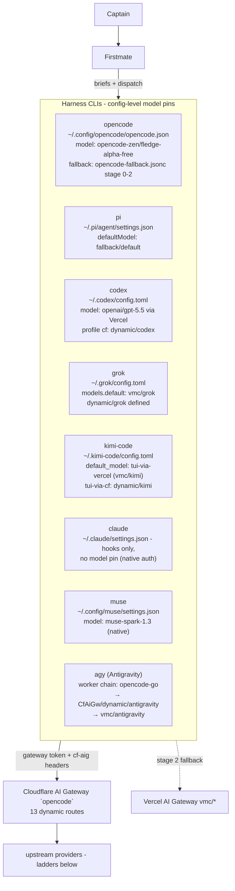

### dynamic/TUI — daily driver (v9e1b829d, 2026-10-05)

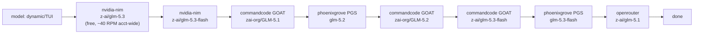

### dynamic/high — GLM-5.3-class + fable (v a066dc4b)

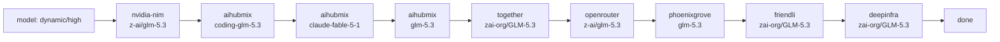

### dynamic/pr-gate — no-mistakes gate route (v b7002724, 2026-10-05)

```mermaid
flowchart LR
    in["model: dynamic/pr-gate"] --> g0["commandcode GOAT<br/>zai-org/GLM-5.2<br/>(60s, thinking)"] --> g1["commandcode GOAT<br/>z-ai/glm-5.3-flash<br/>(60s)"] --> g2["phoenixgrove PGS<br/>glm-5.3-flash<br/>(60s)"] --> g3["phoenixgrove PGS<br/>glm-5.2<br/>(60s)"] --> g4["nvidia-nim<br/>nvidia/nemotron-3-super-120b-a12b<br/>(free)"] --> g5["commandcode GOAT<br/>nvidia/nemotron-3-ultra-550b-a55b"] --> g6["openrouter<br/>openai/gpt-5.6-luna"] --> g7["commandcode GOAT<br/>moonshotai/Kimi-K3"] --> g8["nvidia-nim<br/>moonshotai/kimi-k3"] --> g9["commandcode GOAT<br/>deepseek/deepseek-v4-flash"] --> g10["phoenixgrove PGS<br/>deepseek-v4-flash-0731"] --> g11["google-ai-studio<br/>gemini-2.5-flash"] --> done[done]
```

GLM head rungs are the captain-ordered subscription-utility block
(2026-10-05); while GOAT/PGS credits are dry they 400-fall-through to the
free NIM nemotron rung, which is the verified serving head (2026-10-06).
The zen `nemotron-3-ultra-free` rung and the `custom-zai-coding` element were
excluded (locked free lane / gateway provider-path 404).

### dynamic/pr-reviewer — no-mistakes review route (v 469aa66c)

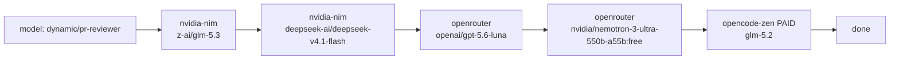

The zen tail is the PAID glm-5.2 (curl-open; the free-tier lock does not
apply to paid zen lanes).

### dynamic/vision (v 711e9bd5)

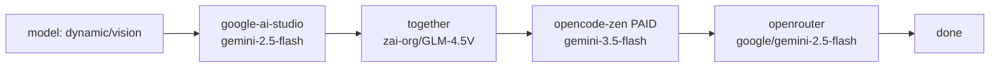

### dynamic/antigravity — agy worker route (v 114df362)

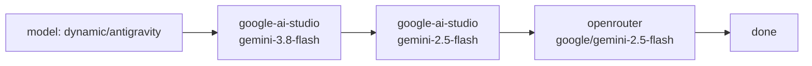

**agy worker chain (2026-10-03, captain-ordered):** `opencode-go`
(subsidized, harness-direct, session-gated — never a route node) →
`CfAiGw/dynamic/antigravity` → `router/antigravity` (Vercel; kind `router`).
All three layers serve the budget 3.8-flash class; the agy `-high` tier suffix
is harness-internal.

### Single-model house routes

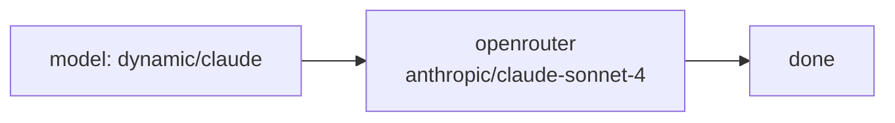

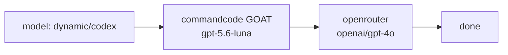

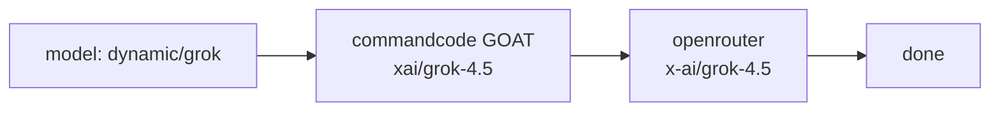

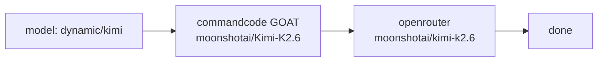

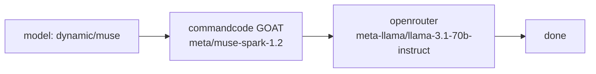

- `dynamic/cursor`: registered, **empty ladder** — no model elements yet.
- `dynamic/test`: single locked zen rung
  (`opencode-zen/nemotron-3-ultra-free`) — retirement candidate (free-tier
  lock makes it 403 for every route consumer).

## Vercel AI Gateway virtual models

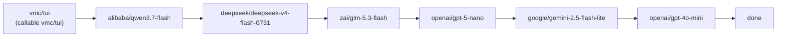

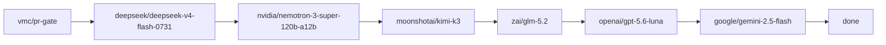

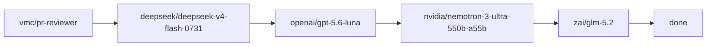

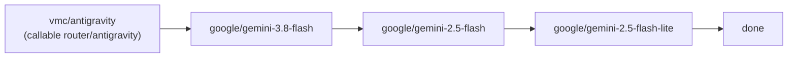

**List-API workaround (resolved 2026-09-27):** Vercel's virtual-model list API
returns empty (upstream quirk), so `vmc/pr-gate` and `vmc/pr-reviewer` were
registered by one-time manual `routes` seed; the daily refresh walks their
ladders from those rows. Any NEW Vercel virtual model needs the same one-time
seed before the daily refresh discovers it.

**Callable-kind rule (verified 2026-10-03):** D1 labels every Vercel route
`vmc/<slug>`, but the inference callable depends on kind — `alias` answers to
`vmc/<slug>`, `router` answers ONLY to `router/<slug>`. Pi chains use the
correct `vercel/router/*` form.

## Flow 2 — no-mistakes → pi → chains → routes → models

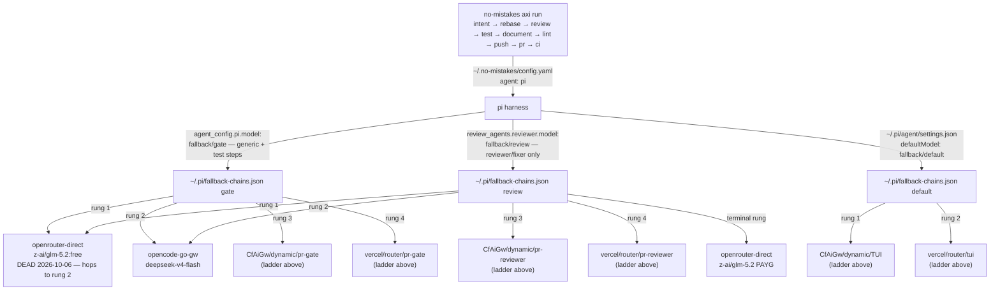

Step-role details, model verdicts, and budgets: `references/d1/NO_MISTAKES_MODELS.md`.

Fledge note (2026-10-04): `opencode-zen/fledge-alpha-free` (stealth preview,
$0, 1M ctx, live-verified) is a candidate for the **interactive primary model
only** — never a no-mistakes pipeline rung (JSON discipline unproven).

## Free lanes, quota and limits

Live values: run `quota-axi`. Dated observations below are snapshots, not state.

| Provider / plane | Plan or auth | Free lane models | Notes |
|---|---|---|---|
| opencode (zen + go) | OpenCode account | zen -free models are in-app-only (client-gated); go pool session-gated | monthly window reset 2026-09-30; 5h/weekly 100% (2026-09-27 snapshot) |
| nvidia-nim (route) | NIM trial key | z-ai/glm-5.3, glm-5.3-flash, nemotron-3-super-120b, kimi-k3, deepseek-v4.1-flash | ~40 RPM account-wide shared across ALL NIM route nodes |
| commandcode (GOAT) | individual-goat subscription | — | **insufficient credits 2026-10-06** — route rungs 400-fall-through until topped up |
| phoenixgrove (PGS) | PGS subscription | — | **insufficient_quota 2026-10-06** — same fall-through behavior |
| zai-coding | Z.AI Coding Plan Lite | — | provider path 404s at the gateway (2026-10-06) — unusable as a route element until repaired |
| openrouter | credit balance + :free lanes | nemotron-3-super-120b-a12b:free, nemotron-3-ultra-550b:free, z-ai/glm-5.2:free (direct; lane DEAD 2026-10-06 — paid slug only) | balance ~6% (2026-09-27) |
| google-ai-studio | $5 min → flash pricing | gemini-2.5/3.8-flash | vision/pr-gate/vision tails |

Model status counts in D1: 50 unknown · 1 degraded (mimo) · 1 quarantined
(space-bunny) · 1 ok. Per-model pricing/context: `models.snapshot.json`.

Quarantine reminder: `openrouter/stealth/space-bunny-alpha` stays out of
every interactive-TUI chain (captain decision 2026-09-25); do not re-add
without explicit captain approval.
