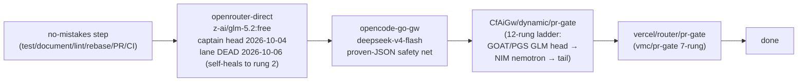
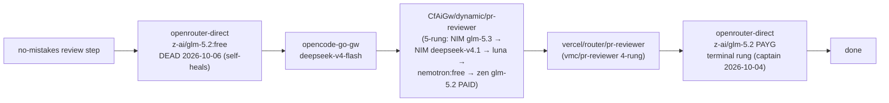
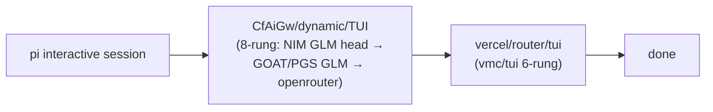

# no-mistakes routing topology + model reliability

Owner of the no-mistakes configuration map: which file, which tag, which
chain, which route, which models — plus the observed-behavior layer (which
models the pipeline steps can actually run on). Ladder truth is the gateway;
flowchart renderings live in `../ROUTING_TOPOLOGY.md`; this file is the
config→route wiring and the observed-behavior record on top.

Deep log: axi-memory `f-2026-10-04-no-mistakes-test-step-json-failures-stal`.

## Configuration files and tags

| File | Owner tags | Effect |
|---|---|---|
| `~/.no-mistakes/config.yaml` | `agent: pi` | every pipeline step runs on the pi harness |
| | `agent_config.pi.model: fallback/gate` | generic steps (test, document, lint, rebase-repair, PR drafting, CI repair) ride pi's `fallback/gate` chain |
| | `review_agents.reviewer.model: fallback/review` | reviewer/fixer steps ride the separate `fallback/review` chain |
| | `review_agent_timeout: 12m` / `test_agent_timeout: 25m` | budget kills (step_quiet_warning 10m is observability only) |
| | `auto_fix.{rebase,lint,test,document,ci}: 3`, `auto_fix.review: 0` | follow-up fix attempts per step |
| | `session_reuse: true` | one durable fixer session per run across review-fix turns (claude/codex) |
| | `intent.enabled: false` | user-intent extraction disabled fleet-wide (2026-09-02 incident) |
| | `test.evidence.store_in_repo: true` (dir `.no-mistakes/evidence`) | test artifacts land in the PR |
| `~/.pi/fallback-chains.json` | `gate` / `review` / `default` arrays | ordered harness-level fallback chains (flowcharts below) |
| `~/.pi/agent/settings.json` | `defaultProvider: opencode-zen`, `defaultModel: fallback/default`, `packages: npm:pi-fallback-provider` | pi resolves `fallback/<chain>` through the fallback provider package |
| `~/.pi/agent/models.json` | `providers.*` (baseUrl, headers, models) | pi's provider registry: opencode-zen, opencode-go-gw (x-opencode-session header), commandcode, zai-coding, cloudflare, openrouter (gateway passthrough), openrouter-direct (api.openrouter.ai + OPENROUTER_API_KEY), phoenixgrove, gemini (local 127.0.0.1:18903), cerebras, nvidia, CfAiGw (compat routes), vercel |

Note: the file is `~/.pi/fallback-chains.json` (not "fallback-models.json");
`~/.pi/agent/models.json` is the provider registry, `models-store.json` is a
pi-internal cache — configuration lives in the two named files.

## Chain → route → model flowcharts

### gate chain (generic + test steps)

### review chain (reviewer/fixer steps)

### default chain (pi's own sessions)

pr-gate route change (2026-10-05, captain-ordered): zen `nemotron-3-ultra-free`
rung removed (free-tier lock — 403 for every route consumer); head is now the
GOAT→PGS GLM subscription block with the free NIM nemotron right behind; the
`custom-zai-coding` element was excluded because that provider path 404s at
the gateway (verified 2026-10-06). While GOAT/PGS credits are dry the route
walks straight to the free NIM nemotron rung (verified serving 2026-10-06).

## Why no-mistakes is stricter than chat

Pipeline steps must emit **machine-parseable structured JSON** — findings
arrays, verdict objects, test summaries. A model that interleaves prose with
JSON, or drops template literals into findings text, breaks the step even when
its actual review/test work was correct. Symptom classes observed:

1. `invalid character '$' after array element` — description text contained a
   `${...}` template literal OUTSIDE a string.
2. `invalid character 'T' after top-level value` — valid JSON object followed
   by trailing prose.
3. Silent stalls — agent goes quiet (no tool/log activity) until the step
   budget kill (exit 143).

Parse failures do NOT trigger agent fallback (only invocation failures do), so
a bad rung poisons the whole step. HTTP-level fallback DOES exist at both
layers: pi's chain hops on invocation failure (429/403/timeouts), and each CF
route element falls to the next on error — the chains are linear fallback
ladders, not trees, because linear covers the failure modes and pi's
cross-provider hops already handle whole-gateway outages (CF → Vercel).

## Step-role map (which chain serves which step)

- `review_agents` (global config) covers reviewer/fixer roles ONLY — it does
  NOT select the agents for test, document, lint, or CI repair.
- Test steps ride the global `agent` on `agent_config.<harness>.model` — the
  gate chain. There is no `test_agents` role (verified against no-mistakes
  v1.84.0 global-config reference).
- Reviewer/fixer ride `fallback/review`.
- Generic steps (document, lint, rebase-repair, PR drafting) ride the global
  agent with the generic `agent_timeout`.

## Verdict table (2026-10-04 forensics)

| Model | Role tested | Result |
|---|---|---|
| `opencode-go-gw/deepseek-v4-flash` | review chain head (reviewer/fixer) | CLEAN — strict JSON all day, no stalls; reviews 36s–434s. Later stalled twice as TEST agent (51m silent at 60m; quiet 6m at 12m budget) — reliable JSON, can go quiet on long test drives. Now rung-2 on both chains. |
| `opencode-go-gw/longcat-2.5-preview-free` | gate chain head (test steps) | BROKEN — both JSON failure modes + 51m silent stalls ×3 in one day; removed from the gate chain (dotfiles PR #392). **Light work / scout-class ONLY** (captain 2026-10-04) — never a JSON-bearing pipeline role again. Also dropped from opencode's fallback stage 0 (captain 2026-10-05). |
| `openrouter-direct/z-ai/glm-5.2:free` | gate + review chain HEAD (captain directive 2026-10-04) | UNPROVEN on this pipeline — free OpenRouter glm variant first for every JSON-bearing stage; deepseek rung-2 is the safety net (429/403 invocations fall through; silent stalls do NOT). Discipline under observation — report first JSON failure or stall pattern. PAYG `z-ai/glm-5.2` stays the review chain's terminal rung. **2026-10-06: free lane DEAD upstream ("unavailable for free, use paid slug"); live gate probe self-healed to rung-2 OK — head re-point pending captain.** |
| GOAT/PGS GLM (commandcode zai-org/GLM-5.2, phoenixgrove glm-5.3-flash/5.2) | pr-gate route head (captain order 2026-10-05) | PENDING — subscriptions reported insufficient credits 2026-10-06; route walks through to free NIM nemotron until topped up. GLM fit rationale: reasoning-capable, JSON-bearing (same family as the captain's chosen gate heads), subscription utility instead of rate-capped free NIM. |

## Budgets (dot_no-mistakes/config.yaml, PR #392)

`review_agent_timeout`: **12m**; `test_agent_timeout`: **25m** (both were 60m
until the 2026-10-04 tightening; test raised 12m → 25m after two glm-headed
test drives were cut at 12m while actively working — provider slowness under
the free lane, not stalls). Observed legitimate durations: review 36s–434s;
test 2.5m–7.7m clean, worst ~19.8m with two fix rounds.
`step_quiet_warning: 10m` is observability only — it never cancels; the budget
kill is the stop.

## Per-harness config → route wiring

| Harness | Config file | Tag | Flows to |
|---|---|---|---|
| opencode | `~/.config/opencode/opencode.json` + `opencode-fallback.jsonc` | `.model` (session primary), `fallback_models` stage 0–2 | zen/go direct lanes (stage 0), `CfAiGw/dynamic/TUI` (stage 1), `vercel/vmc/tui` (stage 2) |
| pi | `~/.pi/agent/settings.json`, `~/.pi/agent/models.json`, `~/.pi/fallback-chains.json` | `defaultModel: fallback/default`, chain arrays | chains above |
| codex | `~/.codex/config.toml` | `model = "openai/gpt-5.5"`, `model_provider = "vercel-aig"`; `[profiles.cf] model = "dynamic/codex"` | Vercel AI GW by default; `CfAiGw/dynamic/codex` on the cf profile |
| grok | `~/.grok/config.toml` | `[models] default = "vmc/grok"`; `[model."dynamic/grok"]` | Vercel vmc/grok by default; `CfAiGw/dynamic/grok` defined |
| kimi-code | `~/.kimi-code/config.toml` (+ `KIMI_CODE_CUSTOM_HEADERS` in `~/.zshenv`) | `default_model = "tui-via-vercel"` → `vmc/kimi`; `[models.tui-via-cf] model = "dynamic/kimi"` | Vercel vmc/kimi by default; `CfAiGw/dynamic/kimi` defined |
| claude | `~/.claude/settings.json` | hooks only — no model pin | native Anthropic auth; `dynamic/claude` exists for future pinning |
| muse | `~/.config/muse/settings.json` | `model: muse-spark-1.3` | native muse; `dynamic/muse` exists for future pinning |
| agy | worker chain (provider-catalog skill §Antigravity) | `opencode-go` → `CfAiGw/dynamic/antigravity` → `router/antigravity` | 3.8-flash budget class |
| cursor | — | no config-level flow on this host | `dynamic/cursor` route exists, empty ladder |

## Operational gotchas

- Test rounds that drive real Docker leave `nmt-*` containers on the daemon
  (net=none, no ports). Harmless but should be removed after the run:
  `docker ps -a --format '{{.Names}}' | grep nmt`.
- A run's intent text lives in `~/.no-mistakes/state.sqlite` (`runs` table) —
  recoverable verbatim if a retry needs it.
- Changing `~/.pi/fallback-chains.json` (chezmoi: `private_dot_pi/`) or
  `dot_no-mistakes/config.yaml` takes effect at the NEXT run's setup — the
  shipping run itself is the validation run.
