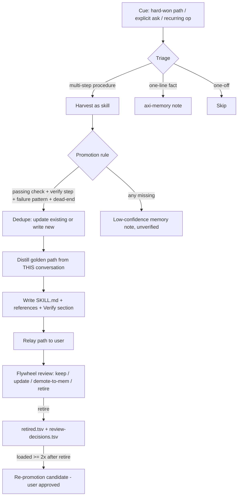

# Harvest decision flow (mermaid)

Trial of the "golden-path decision map" pattern from the Improvements section.
A harvested skill that needs a map should follow this shape: flowchart in
`references/`, detail sections in `SKILL.md`, each node drilling into the
section that owns the exact commands, verify steps, and dead-ends.

This flowchart is the map for the self-learning skill itself. Load it first,
then drill into the SKILL.md sections it names.

## Drill-down map

| Node | Detail lives in |
|---|---|
| B Triage | SKILL.md → "Skill, memory, or skip?" |
| F Promotion rule | SKILL.md → "Promotion rule: don't enshrine guesses" |
| G Dedupe | SKILL.md → Harvest procedure step 3 |
| I/J Write | SKILL.md → "Delegate the write" + `references/skill-authoring.md` + `assets/SKILL.template.md` |
| L Flywheel review | SKILL.md → "Review for demotion" |

## How to use this in a harvested skill

- Keep the flowchart small (one screen): decisions as diamonds, states as
  rectangles, dead-ends named on the edge label.
- Every meaningful node gets a row in the drill-down table pointing at the
  section that owns the detail — this is what keeps the map deterministic
  instead of decorative.
- Regenerate or prune the map when the procedure changes; a stale map is worse
  than none.
